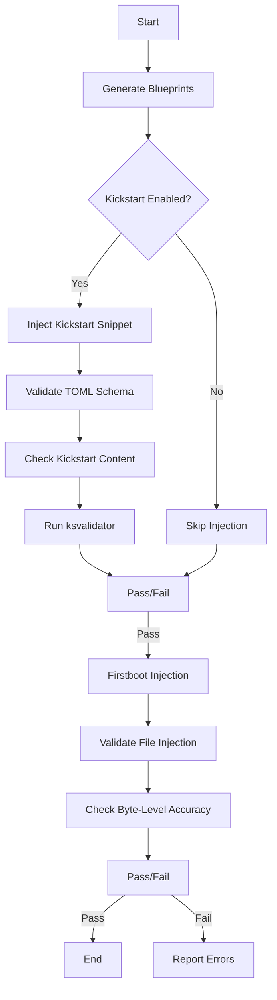

## **Purpose and Scope**
This page documents how the **OSBuild role** validates the injection of **Kickstart** (automated installation) and **Firstboot** (post-install user setup) configurations into system images. The validation ensures:
- **Kickstart**: Correct disk selection, partitioning, and Anaconda module integration.
- **Firstboot**: Reliable user interaction flows, tool availability, and dotfile repository setup.

The validation spans **unit tests**, **integration tests**, and **schema enforcement**, guaranteeing idempotency and conflict-free blueprint generation.

---

## **1. Kickstart Injection Validation**

### **1.1 Core Validation Logic**
The Kickstart validation ensures:
- **Disk Selection**: NVMe disks are prioritized over SATA/USB; removable/read-only disks are excluded.
- **Partitioning**: Dynamic layout calculation based on disk size (e.g., `/usr` capped at 256 GiB, `/home` created only if sufficient space exists).
- **Schema Compliance**: Blueprints must not define conflicting user/group configurations or unattended install flags.

#### **Key Files**
- **Kickstart Template**: [`files/kickstart/syncopated.ks`](files/kickstart/syncopated.ks#L1-L146)
  Defines the Anaconda installer configuration, including `%pre` disk selection logic.
- **Validation Script**: [`tests/kickstart/check_kickstart.py`](tests/kickstart/check_kickstart.py#L1-L108)
  Parses blueprints to verify Kickstart injection, TOML schema, and byte-level accuracy.

#### **Validation Workflow**
1. **Blueprint Preparation**:
   - Static blueprints (e.g., `files/almalinux/10/workstation.toml`) are processed twice to test idempotency.
   - Templated blueprints are rendered with `osbuild_kickstart_enabled: true/false`.
2. **Schema Checks**:
   - Ensures no `[[customizations.user]]` or `installer.unattended` conflicts exist.
   - Validates the presence of the Anaconda Users module (`org.fedoraproject.Anaconda.Modules.Users`).
3. **Kickstart Content Validation**:
   - Compares rendered Kickstart content against the source file (`syncopated.ks`).
   - Uses `ksvalidator` (if available) to check syntax.

#### **Example Test Case**
```python
# tests/kickstart/check_kickstart.py#L45-L60
def strip_layout(contents):
    """Strip the %pre layout block and validate keys."""
    if not contents.startswith(header):
        return None, "kickstart does not start with the lang/keyboard/timezone header"
    m = LAYOUT_RE.match(contents, len(header))
    if not m:
        return None, "layout %pre missing after the header"
    keys = [line.split("=")[0] for line in m.group(1).splitlines()]
    if keys != LAYOUT_KEYS:
        return None, f"layout keys {keys} != {LAYOUT_KEYS}"
    return header + contents[m.end():], None
```
**Sources**: [check_kickstart.py](tests/kickstart/check_kickstart.py#L45-L60)

---

### **1.2 Unit Tests (BATS)**
The [`kickstart.bats`](tests/kickstart/kickstart.bats#L1-L247) test suite validates:
- **Disk Selection Logic**:
  - NVMe disks win over SATA/USB (`F9`).
  - Disks behind `/run/install/repo` are excluded (`F9`).
  - Minimum disk size enforcement (40 GiB, `F10`).
- **Partitioning Rules**:
  - `/usr` and `/var` splits based on disk size (`F12`).
  - `/home` creation only if space exceeds 100 GiB (`F12`).

#### **Example Test**
```bash
@test "F9: NVMe wins over a larger SATA disk" {
  disk sda 2000 sata
  disk nvme0n1 500 nvme
  run bash "$PRE"
  [ "$(target)" = nvme0n1 ]
}
```
**Sources**: [kickstart.bats](tests/kickstart/kickstart.bats#L40-L46)

---

### **1.3 Integration Tests (Ansible)**
The [`validate_kickstart_injection.yml`](tests/validate_kickstart_injection.yml#L1-L154) playbook:
1. **Generates Blueprints**:
   - Processes static and templated blueprints with Kickstart enabled/disabled.
2. **Validates Outputs**:
   - Uses `check_kickstart.py` to verify injection correctness.
   - Tests idempotency (no duplicate Kickstart blocks).
3. **Conflict Detection**:
   - Rejects blueprints with conflicting user/group configurations.

#### **Example Task**
```yaml
- name: Check kickstart in enabled and disabled outputs
  ansible.builtin.command:
    argv: ["python3", "check_kickstart.py", "{{ _out_on }}", "enabled", ...]
```
**Sources**: [validate_kickstart_injection.yml](tests/validate_kickstart_injection.yml#L80-L95)

---

## **2. Firstboot Injection Validation**

### **2.1 Core Validation Logic**
The Firstboot validation ensures:
- **Script Injection**: Three files (`syncopated-firstboot`, `syncopated-firstboot-launcher`, `.desktop`) are injected exactly once into blueprints.
- **User Interaction**: Tests tool availability (e.g., `git`, `yadm`, `gum`) and dotfile repository setup.
- **Idempotency**: The firstboot script stops executing after the first run (via a marker file).

#### **Key Files**
- **Firstboot Script**: [`files/firstboot/syncopated-firstboot`](files/firstboot/syncopated-firstboot#L1-L391)
  Handles dotfile repository cloning and user prompts.
- **Validation Script**: [`tests/firstboot/check_injection.py`](tests/firstboot/check_injection.py#L1-L47)
  Verifies blueprint injection and byte-level accuracy of firstboot files.

#### **Validation Workflow**
1. **Blueprint Preparation**:
   - Static and templated blueprints are processed twice to test idempotency.
2. **Injection Checks**:
   - Ensures each firstboot file is injected exactly once.
   - Validates `data` fields match source files byte-for-byte.
3. **Conflict Detection**:
   - Rejects blueprints with legacy `custom-first-boot` entries.

#### **Example Test Case**
```python
# tests/firstboot/check_injection.py#L20-L30
for path, src in INJECTED.items():
    hits = [f for f in files if f.get("path") == path]
    if len(hits) != 1:
        errors.append(f"{bp.name}: {path} present {len(hits)} times")
    want = (src_dir / src).read_bytes()
    if hits[0].get("data", "").encode("utf-8") != want:
        errors.append(f"{bp.name}: {path} data differs from {src}")
```
**Sources**: [check_injection.py](tests/firstboot/check_injection.py#L20-L30)

---

### **2.2 Unit Tests (BATS)**
The [`firstboot.bats`](tests/firstboot/firstboot.bats#L1-L419) test suite validates:
- **User Interaction**:
  - Tool availability checks (`git`, `yadm`, `gum`).
  - Dotfile repository URL pre-filling (`F12`).
- **Terminal Launchers**:
  - Preference for `xdg-terminal-exec` over `ptyxis` (`F9`).
  - No `sudo` usage in the launcher (`F9`).

#### **Example Test**
```bash
@test "fact 10: missing yadm is downloaded to ~/.local/bin/yadm" {
  rm "$BIN/yadm"
  answers "Set up dotfiles" "__default__"
  run "$SCRIPT" </dev/null
  [ -x "$HOME/.local/bin/yadm" ]
}
```
**Sources**: [firstboot.bats](tests/firstboot/firstboot.bats#L120-L128)

---

### **2.3 Integration Tests (Ansible)**
The [`validate_firstboot_injection.yml`](tests/validate_firstboot_injection.yml#L1-L83) playbook:
1. **Generates Blueprints**:
   - Processes static and templated blueprints twice.
2. **Validates Outputs**:
   - Uses `check_injection.py` to verify injection correctness.
   - Ensures no duplicate or conflicting entries exist.

#### **Example Task**
```yaml
- name: Check injected entries
  ansible.builtin.command:
    argv: ["python3", "check_injection.py", "{{ _out_dir }}", "{{ _role_dir }}/files/firstboot", ...]
```
**Sources**: [validate_firstboot_injection.yml](tests/validate_firstboot_injection.yml#L60-L65)

---

## **3. Schema Validation**
Both Kickstart and Firstboot validations enforce **TOML schema checks** to prevent runtime failures:
- **Kickstart**:
  - No `[[customizations.user]]` or `installer.unattended` conflicts.
  - Anaconda Users module must be enabled.
- **Firstboot**:
  - No legacy `custom-first-boot` entries.
  - Injected files must match source files byte-for-byte.

#### **Example Schema Check**
```yaml
# tasks/validate_components.yml#L10-L20
- name: Check all components have required schema fields
  ansible.builtin.assert:
    that:
      - osbuild_component_defs[item].label is defined
      - osbuild_component_defs[item].packages is defined
      - osbuild_component_defs[item].requires is defined
```
**Sources**: [validate_components.yml](tasks/validate_components.yml#L10-L20)

---

## **4. Visual Workflow**
The following Mermaid diagram illustrates the validation workflow:



---

## **5. Next Steps**
- **[Schema Validation and Best Practices](22-schema-validation-and-best-practices)**: Learn how to extend validation for custom components.
- **[Testing Framework: BATS and Python Tests](20-testing-framework-bats-and-python-tests)**: Explore the testing tools used in this role.
- **[Debugging Build Failures and Log Analysis](23-debugging-build-failures-and-log-analysis)**: Troubleshoot validation failures.

**Sources**:
- [validate_kickstart_injection.yml](tests/validate_kickstart_injection.yml#L1-L154)
- [validate_firstboot_injection.yml](tests/validate_firstboot_injection.yml#L1-L83)
- [kickstart.bats](tests/kickstart/kickstart.bats#L1-L247)
- [firstboot.bats](tests/firstboot/firstboot.bats#L1-L419)
- [check_kickstart.py](tests/kickstart/check_kickstart.py#L1-L108)
- [check_injection.py](tests/firstboot/check_injection.py#L1-L47)