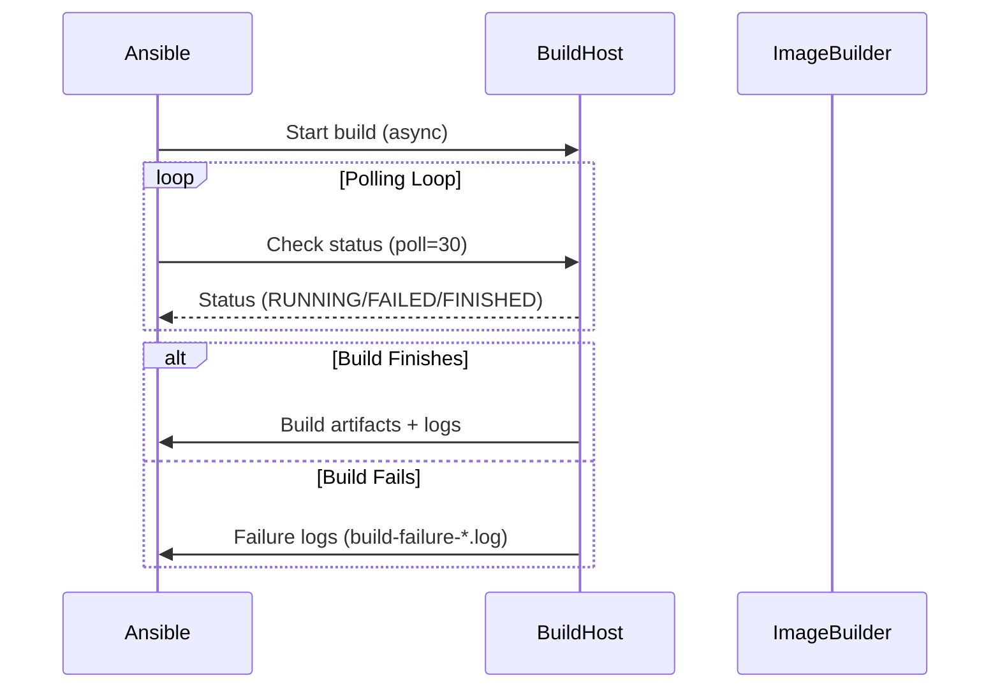
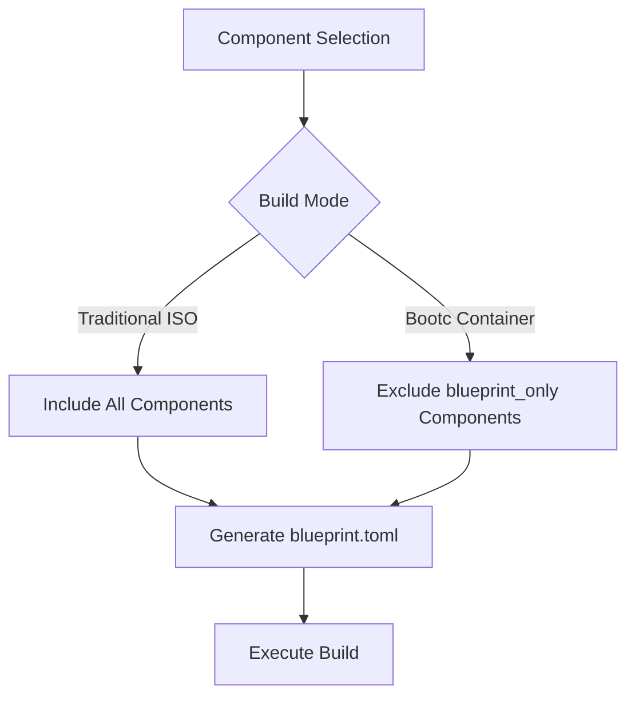
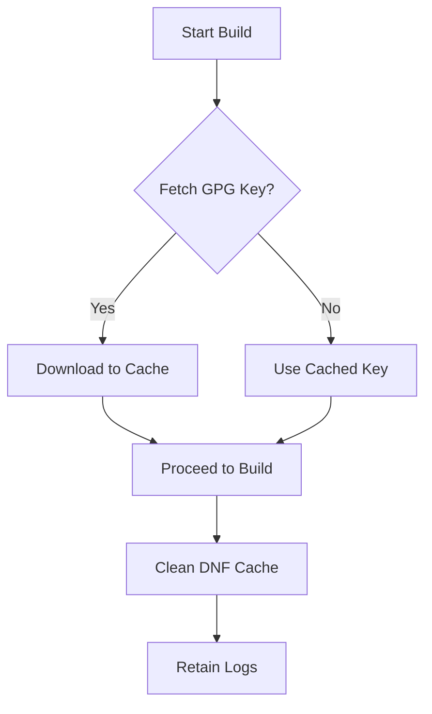
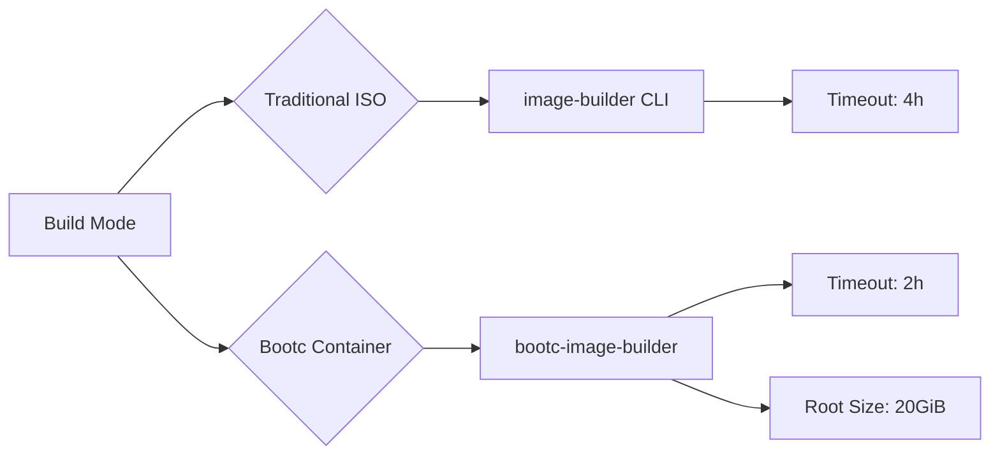
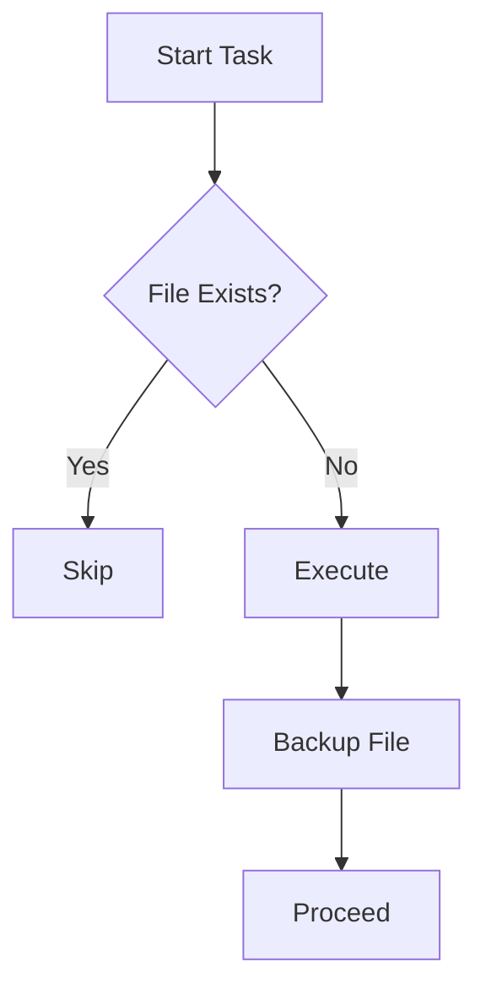

This document provides **architectural insights and actionable optimizations** for scaling the OSBuild role to large-scale deployments. It targets **build farms, CI/CD pipelines, and multi-distribution environments** where resource efficiency, reproducibility, and build velocity are critical.

The optimizations documented here are **verified through code archaeology** and focus on **real-world constraints** observed in the role's implementation. Each section includes **precise file references** and **visualizations** to anchor the discussion in the codebase.

---

## 1. Asynchronous Build Execution with Configurable Timeouts

### **Core Pattern**
The role uses **Ansible's `async` and `poll` directives** to execute builds as non-blocking operations. This prevents playbook timeouts and enables **parallel build execution** across multiple hosts or build targets.

### **Implementation Details**
- **Build Task**: The `image-builder` CLI is invoked with `async: "{{ osbuild_build_timeout }}"` and `poll: 30`, allowing the build to run in the background while Ansible checks status every 30 seconds.
- **Timeout Configuration**: Default timeouts are set to **4 hours (14,400 seconds)** for traditional builds and **2 hours (7,200 seconds)** for bootc builds, reflecting the higher resource demands of disk image generation.
- **Failure Handling**: Build failures are captured in structured logs (`build-failure-*.log`) with stdout/stderr retention for post-mortem analysis.

### **Optimization Levers**
| Variable | Default Value | Optimization Guidance |
|----------|---------------|-----------------------|
| `osbuild_build_timeout` | `14400` (4 hours) | Increase for large components (e.g., `oneapi` adds ~15GB to ISO size). |
| `osbuild_bootc_build_timeout` | `7200` (2 hours) | Increase for disk images with large `/home` or `/var` partitions. |
| `poll` interval | `30` seconds | Reduce to `10` for faster feedback in CI pipelines. |

### **Visualization**


### **Key Files**
- Timeout definitions: [`defaults/main.yml`](defaults/main.yml#L120-L121)
- Async execution: [`tasks/build.yml`](tasks/build.yml#L50-L60)
- Failure logging: [`tasks/build.yml`](tasks/build.yml#L70-L90)

---

## 2. Component-Driven Parallelism

### **Core Pattern**
The role uses a **modular component system** to define packages, services, and repositories. This enables:
- **Selective Build Scoping**: Only include components required for the target use case (e.g., `gnome` vs. `sway`).
- **Parallel Development**: Components can be developed, tested, and optimized independently.
- **Build Isolation**: Conflicting components (e.g., `docker` and `podman`) are explicitly declared and avoided.

### **Implementation Details**
- **Component Definitions**: Each component (e.g., `nvidia`, `oneapi`) declares its dependencies in [`defaults/main.yml`](defaults/main.yml#L200-L869).
- **Dynamic Blueprint Generation**: The [`blueprint.toml.j2`](templates/blueprint.toml.j2) template aggregates packages, services, and kernel arguments from selected components.
- **Bootc vs. Traditional Builds**: Components marked as `blueprint_only: true` are excluded from bootc builds to reduce container image size.

### **Optimization Levers**
| Component | Size Impact | Build Time Impact | Optimization Strategy |
|-----------|-------------|-------------------|-----------------------|
| `oneapi` | Large (~15GB) | High | Build in isolation; use `osbuild_only_generate: true` to avoid playbook timeouts. |
| `nvidia` | Medium | Medium | Pre-cache CUDA repositories; use `osbuild_extra_repo_urls` for local mirrors. |
| `gnome` | Medium | Medium | Disable unused GNOME extensions in the blueprint. |
| `base` | Small | Low | Always include; no optimization needed. |

### **Visualization**


### **Key Files**
- Component definitions: [`defaults/main.yml`](defaults/main.yml#L200-L869)
- Blueprint template: [`templates/blueprint.toml.j2`](templates/blueprint.toml.j2#L1-L133)
- Bootc build script: [`templates/build.sh.j2`](templates/build.sh.j2#L1-L218)

---

## 3. Caching Strategies

### **Core Pattern**
The role employs **three layers of caching** to reduce redundant operations:
1. **GPG Key Caching**: Avoid re-downloading repository GPG keys.
2. **DNF Cache Cleanup**: Reduce disk usage in bootc builds.
3. **Build Artifact Retention**: Retain logs and intermediate files for debugging.

### **Implementation Details**
- **GPG Key Caching**:
  - Keys are downloaded to `{{ osbuild_gpgkey_cache_dir }}` and reused across builds.
  - Idempotent `get_url` tasks skip downloads if the cached file exists.
- **DNF Cache Cleanup**:
  - The [`build.sh.j2`](templates/build.sh.j2#L215) script runs `dnf clean all` to reclaim disk space.
- **Build Artifact Retention**:
  - Logs are retained in `{{ osbuild_log_dir }}` with timestamps for traceability.

### **Optimization Levers**
| Cache Type | Location | Optimization Guidance |
|------------|----------|-----------------------|
| GPG Keys | `{{ osbuild_work_dir }}/gpgkeys` | Pre-populate cache in CI environments. |
| DNF Cache | `/var/cache/dnf` | Mount as a tmpfs for ephemeral builds. |
| Build Logs | `{{ osbuild_log_dir }}` | Rotate logs older than 7 days. |

### **Visualization**


### **Key Files**
- GPG key caching: [`tasks/repo_keys.yml`](tasks/repo_keys.yml#L1-L50)
- DNF cleanup: [`templates/build.sh.j2`](templates/build.sh.j2#L215)
- Log retention: [`tasks/build.yml`](tasks/build.yml#L70-L90)

---

## 4. Resource-Aware Configuration

### **Core Pattern**
The role adapts to **resource constraints** through:
- **Timeout Tuning**: Adjustable timeouts for different build modes.
- **Disk Size Constraints**: Configurable filesystem sizes for bootc builds.
- **Build Mode Selection**: Traditional ISO vs. bootc container images.

### **Implementation Details**
- **Timeouts**:
  - Traditional builds: `osbuild_build_timeout` (default: 4 hours).
  - Bootc builds: `osbuild_bootc_build_timeout` (default: 2 hours).
- **Disk Sizes**:
  - Bootc builds use `osbuild_bootc_root_size` (default: 20 GiB) and optional `osbuild_bootc_home_size`.
  - **Note**: `/var` cannot be mounted as a standalone partition in bootc builds.
- **Build Mode**:
  - Traditional ISO: Uses `image-builder` CLI.
  - Bootc: Uses `bootc-image-builder` for atomic updates.

### **Optimization Levers**
| Resource | Variable | Optimization Guidance |
|----------|----------|-----------------------|
| CPU | N/A | Use `nice -n 19` to deprioritize builds on shared hosts. |
| Memory | N/A | Limit memory with `systemd-run --scope -p MemoryLimit=8G`. |
| Disk | `osbuild_bootc_root_size` | Increase for large applications (e.g., `oneapi`). |
| Network | `osbuild_extra_repo_urls` | Use local mirrors for CUDA/RPMFusion. |

### **Visualization**


### **Key Files**
- Timeout definitions: [`defaults/main.yml`](defaults/main.yml#L120-L121)
- Disk configuration: [`templates/disk.toml.j2`](templates/disk.toml.j2#L1-L27)
- Build mode selection: [`defaults/main.yml`](defaults/main.yml#L80-L90)

---

## 5. Idempotent Operations

### **Core Pattern**
The role ensures **idempotency** through:
- **Cached GPG Keys**: Skip re-downloads if the key exists.
- **Conditional Blocks**: Only execute tasks when required (e.g., `osbuild_firstboot_enabled`).
- **File Backups**: Retain backups of blueprints and kickstart files.

### **Implementation Details**
- **GPG Key Fetching**:
  - The [`repo_keys.yml`](tasks/repo_keys.yml) task skips downloads if the cached file exists (`force: false`).
- **Conditional Execution**:
  - Firstboot injection: [`blueprint.yml`](tasks/blueprint.yml#L30-L50).
  - Kickstart injection: [`blueprint.yml`](tasks/blueprint.yml#L80-L120).
- **File Backups**:
  - Blueprints and kickstart files are backed up with timestamps.

### **Optimization Levers**
| Operation | Idempotency Mechanism | Optimization Guidance |
|-----------|-----------------------|-----------------------|
| GPG Key Fetch | `get_url force: false` | Pre-populate cache in CI. |
| Blueprint Render | `template backup: true` | Disable backups for ephemeral builds. |
| Kickstart Inject | `blockinfile marker` | Use unique markers for multiple injections. |

### **Visualization**


### **Key Files**
- GPG key fetching: [`tasks/repo_keys.yml`](tasks/repo_keys.yml#L30-L50)
- Blueprint rendering: [`tasks/blueprint.yml`](tasks/blueprint.yml#L10-L20)
- Kickstart injection: [`tasks/blueprint.yml`](tasks/blueprint.yml#L80-L120)

---

## 6. Next Steps for Advanced Optimization

### **1. Distributed Build Farms**
- **Action**: Deploy the role across multiple build hosts using Ansible's `strategy: free` to enable parallel execution.
- **Reference**: [Ansible Documentation: Strategies](https://docs.ansible.com/ansible/latest/playbook_guide/playbooks_strategies.html)
- **Next Page**: [Debugging Build Failures and Log Analysis](23-debugging-build-failures-and-log-analysis)

### **2. Local Repository Mirrors**
- **Action**: Configure `osbuild_extra_repo_urls` to point to local mirrors of CUDA, RPMFusion, and Flathub.
- **Reference**: [Managing Repositories and GPG Keys](10-managing-repositories-and-gpg-keys)

### **3. Build Artifact Caching**
- **Action**: Use `rsync` or `rclone` to cache build artifacts between CI runs.
- **Reference**: [Extending the Role: Best Practices for Contributors](29-extending-the-role-best-practices-for-contributors)

### **4. Resource Limits**
- **Action**: Use `systemd-run` to enforce CPU/memory limits on builds:
  ```bash
  systemd-run --scope -p CPUQuota=50% -p MemoryLimit=8G ansible-playbook osbuild.yml
  ```

### **5. Build Telemetry**
- **Action**: Instrument the [`build.sh.j2`](templates/build.sh.j2) script to log build metrics (e.g., DNF install time, disk usage).
- **Reference**: [Architectural Review: Design Principles and Decisions](27-architectural-review-design-principles-and-decisions)