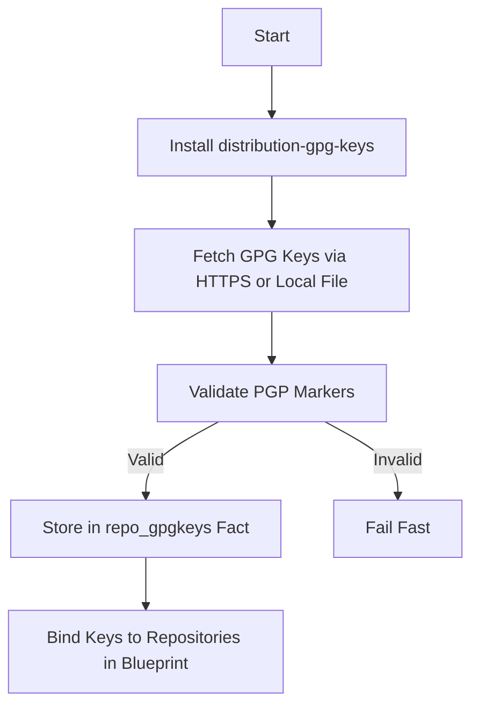

This page explains the **security hardening measures** integrated into the `osbuild` role for generating secure, reproducible, and minimal Linux images. It covers **GPG key validation, repository security, component isolation, kernel hardening, and immutability patterns** for both traditional ISO and bootc container images.

Security hardening is not a standalone feature but a **cross-cutting concern** woven into the role's architecture. The following sections dissect the patterns, their implementation, and their impact on the final image.

---

## 1. Repository Security and GPG Key Validation

### **Core Pattern: Trust Anchoring via GPG Keys**
All external repositories used in the build process are **cryptographically verified** using GPG keys. The role enforces this via a **three-stage validation pipeline**:

1. **Key Sourcing**: Keys are fetched from trusted URLs or local files (e.g., `distribution-gpg-keys` package).
2. **Key Validation**: Keys are checked for PGP markers (`-----BEGIN/END PGP PUBLIC KEY BLOCK-----`).
3. **Repository Binding**: Keys are bound to repositories in the generated blueprint or bootc image.

## **Implementation Details**
### **Key Fetching and Validation**
The `repo_keys.yml` task file implements the validation pipeline:
- **HTTPS Fetching**: Keys are downloaded using `ansible.builtin.get_url` with `validate_certs: true` and a 30-second timeout.
- **Local File Fallback**: Keys are sourced from `/usr/share/distribution-gpg-keys/` (installed via the `distribution-gpg-keys` package).
- **PGP Marker Assertion**: Keys are validated for the presence of PGP markers before being used.
- **In-Memory Storage**: Validated keys are stored in the `repo_gpgkeys` fact for later use in repository configurations.



**Sources**: [`tasks/repo_keys.yml`](tasks/repo_keys.yml#L20-L115)

### **Repository Configuration**
Repositories are defined in distribution-specific variable files (e.g., `vars/Fedora.yml`, `vars/AlmaLinux.yml`). Each repository includes:
- **Base URL or Metalink**: Points to the repository's package index.
- **GPG Key URL**: Specifies the key used to sign packages.
- **GPG Check Flag**: Enables or disables GPG validation (`check_gpg: true/false`).

**Example (Fedora)**:
```yaml
repo:
  fedora:
    metalink: "https://mirrors.fedoraproject.org/metalink?repo=fedora-43&arch=x86_64"
    gpgkey_url: "file:///usr/share/distribution-gpg-keys/fedora/RPM-GPG-KEY-fedora-43-primary"
    check_gpg: true
```
**Sources**: [`vars/Fedora.yml`](vars/Fedora.yml#L19-L27), [`vars/AlmaLinux.yml`](vars/AlmaLinux.yml#L14-L22), [`vars/Rocky.yml`](vars/Rocky.yml#L17-L23)

### **Key Exceptions**
- **Non-GPG Repositories**: Some repositories (e.g., `antigravity-rpm`) disable GPG checks (`check_gpg: false`). This is **not recommended** for production builds but is retained for compatibility.
- **DNF Variables**: AlmaLinux and Rocky Linux repositories use `$releasever` and `$basearch` in URLs. These are **not interpolated by Ansible** and are passed as-is to `image-builder`. If `image-builder` does not expand these variables, the repository URLs may be malformed.

**Sources**: [`vars/AlmaLinux.yml`](vars/AlmaLinux.yml#L16-L17), [`sift-graph-osbuild-report.md`](sift-graph-osbuild-report.md#L70)

---

## 2. Component Isolation and Minimalism

### **Core Pattern: Component-Based Security**
The role uses a **component-based architecture** to define packages, services, and configurations. Each component is a **self-contained unit** with:
- **Explicit Dependencies**: Components declare dependencies (`requires`) and conflicts (`conflicts`).
- **Minimal Footprint**: Components include only the packages and services they need, reducing attack surface.
- **Immutable Configs**: For bootc images, configurations are written to `/usr/etc/` to ensure immutability.

### **Component Schema**
Each component in `osbuild_component_defs` defines:
- **Packages**: List of packages to install.
- **Services**: Systemd services to enable.
- **Kernel Arguments**: Security-relevant kernel parameters (e.g., `rd.driver.blacklist=nouveau`).
- **Sources**: Repositories required for the component.
- **Conflicts**: Components that cannot coexist (e.g., `gnome` and `sway`).

**Example (NVIDIA Component)**:
```yaml
nvidia:
  label: "NVIDIA proprietary driver + CUDA stack"
  packages: ["akmod-nvidia", "xorg-x11-drv-nvidia-cuda", "nvidia-container-toolkit"]
  services: ["nvidia-persistenced"]
  kernel_args: ["rd.driver.blacklist=nouveau", "modprobe.blacklist=nouveau", "nvidia-drm.modeset=1"]
  sources: ["rpmfusion-nonfree-nvidia-driver", "cuda-fedora43-x86_64", "nvidia-container-toolkit"]
  conflicts: []
  secure_boot_compatible: false
```
**Sources**: [`defaults/main.yml`](defaults/main.yml#L264-L288)

### **Validation**
The `validate_components.yml` task ensures:
- All selected components exist in `osbuild_component_defs`.
- No conflicting components are selected.
- All required schema fields are present.

**Sources**: [`tasks/validate_components.yml`](tasks/validate_components.yml#L1-L56)

---

## 3. Kernel Hardening

### **Core Pattern: Secure Kernel Parameters**
Kernel command-line arguments are used to **harden the system** against common vulnerabilities. These are defined in component definitions and aggregated in the blueprint.

### **Key Kernel Arguments**
| Argument | Purpose | Component |
|----------|---------|-----------|
| `rd.driver.blacklist=nouveau` | Blacklist Nouveau driver (NVIDIA) | `nvidia` |
| `modprobe.blacklist=nouveau` | Prevent Nouveau module loading | `nvidia` |
| `nvidia-drm.modeset=1` | Enable NVIDIA DRM modesetting | `nvidia` |
| `DRACUT_NO_XATTR=1` | Disable extended attributes in initramfs | `nvidia` |
| `selinux=1` | Enforce SELinux (default in Fedora/EL) | `base` |
| `audit=1` | Enable audit logging | `base` |

**Sources**: [`defaults/main.yml`](defaults/main.yml#L270-L272), [`templates/blueprint.toml.j2`](templates/blueprint.toml.j2#L48-L57)

### **Aggregation in Blueprint**
Kernel arguments from all components are **concatenated** and appended to the blueprint's `[customizations.kernel]` section.

**Example**:
```toml
[customizations.kernel]
append = "rd.driver.blacklist=nouveau modprobe.blacklist=nouveau nvidia-drm.modeset=1 selinux=1 audit=1"
```
**Sources**: [`templates/blueprint.toml.j2`](templates/blueprint.toml.j2#L55-L57)

---

## 4. Immutability in Bootc Images

### **Core Pattern: Ansible Role Inversion**
For **bootc container images**, the role uses **Ansible Role Inversion**:
- Ansible runs **at build time** inside the Containerfile to generate immutable configurations.
- Configurations are written to `/usr/etc/` and `/usr/lib/systemd/system/` to ensure they persist across upgrades.

### **Implementation**
1. **Containerfile Stages**:
   - **Stage 1**: Build context (`FROM scratch`).
   - **Stage 2**: Ansible compilation (`FROM base AS ansible-builder`).
   - **Stage 3**: Runtime image (`FROM base`).

   Ansible is **not shipped** in the final image.

2. **Immutable Configs**:
   - Hostname, OS release, and fstab are templated to `/usr/etc/`.
   - Systemd services (e.g., NVIDIA CDI) are written to `/usr/lib/systemd/system/`.

**Example (Containerfile)**:
```dockerfile
FROM scratch AS ctx
COPY --from=ansible-builder /output/ /usr/

FROM base
COPY --from=ctx /usr/ /usr/
RUN rm -rf /opt && mkdir -p /opt  # Make /opt immutable
```
**Sources**: [`templates/Containerfile.bootc.j2`](templates/Containerfile.bootc.j2#L10-L51), [`files/bootc/build.yml`](files/bootc/build.yml#L1-L130)

### **Exceptions and Risks**
- **Mutable `/etc`**: Some configurations (e.g., sudoers) are written to `/etc/` instead of `/usr/etc/`. This violates immutability and may break on `bootc upgrade`.
- **NVIDIA Repos**: Bootc NVIDIA repositories are written to `/etc/yum.repos.d/`, which is mutable.

**Sources**: [`templates/build.sh.j2`](templates/build.sh.j2#L149-L151), [`defaults/main.yml`](defaults/main.yml#L86-L144), [`sift-graph-osbuild-report.md`](sift-graph-osbuild-report.md#L120-L123)

---

## 5. Secure Boot and NVIDIA Considerations

### **Core Pattern: Secure Boot Compatibility**
The role explicitly marks components as **secure-boot-compatible** or **incompatible**. For example:
- The `nvidia` component sets `secure_boot_compatible: false` due to proprietary drivers.
- The `base` component is secure-boot-compatible.

### **NVIDIA-Specific Hardening**
1. **Nouveau Blacklisting**: The `nvidia` component blacklists the Nouveau driver to prevent conflicts.
2. **CDI for Podman**: The NVIDIA Container Device Interface (CDI) is configured for GPU passthrough in Podman.
3. **Systemd Service**: A one-shot systemd service (`nvidia-cdi-refresh.service`) regenerates CDI specifications at boot.

**Example (NVIDIA CDI Service)**:
```ini
[Unit]
Description=Generate NVIDIA CDI specification for Podman
ConditionPathExists=/usr/bin/nvidia-ctk

[Service]
Type=oneshot
ExecStart=/usr/local/bin/nvidia-cdi-generate.sh
RemainAfterExit=true
```
**Sources**: [`templates/systemd/nvidia-cdi-refresh.service.j2`](templates/systemd/nvidia-cdi-refresh.service.j2#L1-L18)

---

## 6. Kickstart and Firstboot Security

### **Core Pattern: Automated and Secure Installation**
The role uses **kickstart files** to automate installation while enforcing security best practices:
- **Disk Encryption**: Not currently enabled (future enhancement).
- **User Creation**: Anaconda creates the user, and passwordless sudo is configured for the `wheel` group.
- **Firstboot Disabled**: The `firstboot --disable` directive prevents post-installation wizards.

### **Kickstart Hardening**
1. **Disk Layout**:
   - The kickstart file (`syncopated.ks`) uses LVM for flexible disk partitioning.
   - `/boot` is a separate partition (2 GiB, XFS).
   - `/`, `/usr`, `/var`, and `/home` are logical volumes.

2. **Passwordless Sudo**:
   - A sudoers file (`/etc/sudoers.d/90-wheel-nopasswd`) is injected into the blueprint to grant passwordless sudo to the `wheel` group.

**Example (Kickstart)**:
```kickstart
graphical
firstboot --disable
reboot
network --bootproto=dhcp --device=link --activate --onboot=on
ignoredisk --only-use=$best
zerombr
clearpart --all --initlabel --disklabel=gpt --drives=$best
bootloader --boot-drive=$best
reqpart
part /boot --size=2048 --fstype=xfs --ondisk=$best
part pv.00 --size=1 --grow --ondisk=$best
volgroup vg00 pv.00
logvol / --vgname=vg00 --name=root --size=$root --fstype=xfs
```
**Sources**: [`files/kickstart/syncopated.ks`](files/kickstart/syncopated.ks#L11-L145), [`templates/kickstart-sudoers.toml.j2`](templates/kickstart-sudoers.toml.j2#L1-L9)

---

## 7. Risk Mitigation and Known Issues

### **Identified Risks**
| Risk | Severity | Mitigation |
|------|----------|------------|
| **Mutable `/etc` Configs** | Medium | Migrate sudoers and NVIDIA repos to `/usr/etc/`. |
| **AlmaLinux `$releasever`/`$basearch`** | Medium | Replace with Ansible-templated URLs if `image-builder` does not expand DNF variables. |
| **Missing `docker` Component** | Low | Define the `docker` component or remove it from the "Available components" list. |
| **Dual Desktop Environments** | Low | Add `conflicts: [sway]` to the `gnome` component or document intentional coexistence. |
| **Stale Documentation** | Low | Update README to match actual defaults. |

**Sources**: [`sift-graph-osbuild-report.md`](sift-graph-osbuild-report.md#L119-L126)

---

## Next Steps
For further exploration, refer to the following pages in the catalog:
- [Debugging Build Failures and Log Analysis](23-debugging-build-failures-and-log-analysis): Learn how to analyze build logs for security-related issues.
- [Integrating Custom Packages and Repositories](25-integrating-custom-packages-and-repositories): Extend the role with custom packages while maintaining security.
- [Architectural Review: Design Principles and Decisions](27-architectural-review-design-principles-and-decisions): Understand the architectural trade-offs in the role's design.