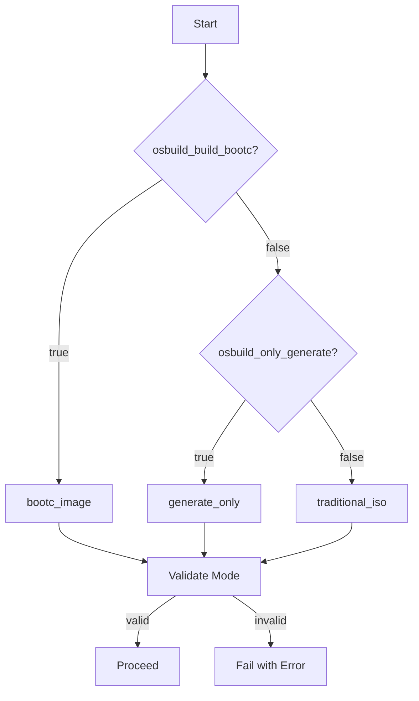

This document dissects the **architectural principles** and **design decisions** underpinning the `osbuild` Ansible role. It targets advanced developers seeking to understand the **strategic trade-offs**, **pattern selections**, and **evolutionary pressures** that shaped the role’s current form. The analysis is grounded in first principles, verified through code archaeology, and presented with precision references to implementation artifacts.

---

## 1. **Core Architectural Hypothesis: Build Mode Orthogonality**

### **Principle: Explicit Mode Selection as a First-Class Citizen**
The role’s foundational hypothesis is that **build mode selection**—whether traditional ISO or `bootc` container image—must be **explicit, deterministic, and fail-fast**. This is implemented via a **mode-resolution task** (`select_build_mode.yml`) that maps user inputs (`osbuild_build_bootc`, `osbuild_only_generate`) into a single, validated `osbuild_resolved_build_mode` fact.

## **Decision: Priority-Based Mode Resolution**
The resolution logic prioritizes `osbuild_build_bootc` over `osbuild_only_generate`:
- If `osbuild_build_bootc=true`, the mode is **always** `bootc_image`.
- If `osbuild_build_bootc=false`, the mode defaults to `generate_only` (blueprint generation without build) unless overridden to `traditional_iso`.

This design ensures **no silent mode conflicts** and enforces a **single source of truth** for downstream tasks. The `assert` task guarantees that unsupported combinations (e.g., `osbuild_build_bootc=true` with `osbuild_only_generate=false`) fail immediately with a descriptive error.

**Pattern Rationale**:
- **Fail-Fast**: Prevents partial builds in ambiguous states.
- **Orthogonality**: Modes are mutually exclusive, simplifying task routing.
- **Backward Compatibility**: Retains `osbuild_only_generate` for traditional ISO workflows while enabling `bootc` as a first-class alternative.

**Implementation**:

Sources: [tasks/select_build_mode.yml](tasks/select_build_mode.yml#L1-L33)

---

## 2. **Principle: Blueprint as a Stateless Artifact**

### **Decision: Dynamic Blueprint Generation with Jinja2**
Blueprints are **never static**; they are **compiled at runtime** from Jinja2 templates (`blueprint.toml.j2`) or copied from static sources (`static_blueprint_path`). This stateless approach ensures:
- **Reproducibility**: Blueprints reflect the exact state of variables at build time.
- **Customizability**: Components, packages, and kernel arguments are injected dynamically from `osbuild_components` and `osbuild_component_defs`.
- **Extensibility**: New components can be added without modifying blueprint templates.

**Key Design Choices**:
1. **Component-Driven Packages/Groups**:
   Packages and groups are **scoped to components** (e.g., `nvidia` or `dev-tools`), enabling modular composition. The template iterates over `osbuild_components` and injects packages/groups from `osbuild_component_defs`.
   ```jinja2
   
   
   
   [[packages]]
   name = "{{ package }}"
   version = "{{ osbuild_package_pins.get(package, '*') }}"
   
   
   
   ```
   Sources: [templates/blueprint.toml.j2](templates/blueprint.toml.j2#L20-L40)

2. **Firstboot Injection as Post-Processing**:
   Firstboot scripts are **appended to the blueprint** after initial rendering, ensuring they are present in **both templated and static blueprints**. This avoids duplicating firstboot logic across templates.
   ```yaml
   - name: Append first-login files to blueprint
     ansible.builtin.blockinfile:
       path: "{{ blueprint_file_path }}"
       marker: "# {mark} syncopated-firstboot"
       block: "{{ lookup('ansible.builtin.template', 'firstboot-files.toml.j2') }}"
   ```
   Sources: [tasks/blueprint.yml](tasks/blueprint.yml#L30-L50)

---

## 3. **Principle: Distribution-Agnostic Abstraction with Fallbacks**

### **Decision: Variable Hierarchy for Multi-Distro Support**
The role supports **Fedora, AlmaLinux, and Rocky** through a **layered variable system**:
1. **Default Variables** (`defaults/main.yml`):
   Define **fallback values** (e.g., `osbuild_image_type: "image-installer"` for EL distros, `"minimal-installer"` for Fedora).
2. **Distribution-Specific Variables** (`vars/Fedora.yml`, `vars/AlmaLinux.yml`):
   Override defaults with **distro-specific configurations** (e.g., repository `metalink` URLs, GPG keys).
3. **Runtime Overrides**:
   Users can override variables via playbook extra vars (`-e`).

**Example: Image Type Resolution**:
```yaml
osbuild_image_type: >-
  {{ 'minimal-installer' if ansible_distribution == 'Fedora' else 'image-installer' }}
```
Sources: [defaults/main.yml](defaults/main.yml#L30-L50)

**GPG Key Strategy**:
- **Prefer Local Keys**: Use `file://` URLs for keys bundled in `distribution-gpg-keys` (e.g., Fedora’s primary key).
- **Fallback to HTTPS**: Fetch keys from upstream if not locally available.
- **Validation**: Keys are verified for a valid PGP block before use.
  ```yaml
  gpgkey_url: "file:///usr/share/distribution-gpg-keys/fedora/RPM-GPG-KEY-fedora-43-primary"
  ```
  Sources: [vars/Fedora.yml](vars/Fedora.yml#L10-L20)

---

## 4. **Principle: Build-Time vs. Runtime Separation**

### **Decision: Ansible Role Inversion for `bootc` Images**
For `bootc` images, the role **inverts the traditional Ansible model**:
- **Build-Time Execution**: Ansible runs **during container image build** (via `Containerfile.bootc.j2`), compiling configurations into `/usr/etc`.
- **Runtime Immutability**: The resulting image is **immutable**; configurations are baked in at build time.

**Multi-Stage Containerfile**:
1. **Stage 1 (`ctx`)**: Copies build scripts and playbooks.
2. **Stage 2 (`ansible-builder`)**: Installs `ansible-core` and runs the playbook to generate configurations.
3. **Stage 3 (`runtime`)**: Strips build tools, leaving only runtime dependencies.
   ```dockerfile
   FROM {{ osbuild_bootc_base_image }} AS ansible-builder
   RUN dnf5 install -y --nodocs ansible-core && dnf5 clean all
   COPY --from=ctx /build.yml /tmp/ansible/build.yml
   RUN ansible-playbook /tmp/ansible/build.yml
   ```
   Sources: [templates/Containerfile.bootc.j2](templates/Containerfile.bootc.j2#L15-L30)

**Rationale**:
- **Security**: Reduces attack surface by excluding build tools from runtime.
- **Reproducibility**: Configurations are **compiled once** and reused across deployments.
- **Performance**: Avoids runtime configuration drift.

---

## 5. **Principle: Fail-Fast with Descriptive Errors**

### **Decision: Assertions for Critical Paths**
The role **aggressively validates** inputs and intermediate states:
1. **Build Mode Validation**:
   ```yaml
   - name: Fail on invalid build mode
     ansible.builtin.assert:
       that: osbuild_resolved_build_mode != 'mode_unknown'
       fail_msg: "Unsupported build mode: osbuild_build_bootc={{ osbuild_build_bootc }}, osbuild_only_generate={{ osbuild_only_generate }}."
   ```
   Sources: [tasks/select_build_mode.yml](tasks/select_build_mode.yml#L20-L25)

2. **Firstboot Script Validation**:
   Ensures firstboot scripts **do not contain TOML literal delimiters (`'''`)** to avoid blueprint corruption.
   ```yaml
   - name: Assert first-login files fit in TOML literal strings
     ansible.builtin.assert:
       that: "\"'''\" not in lookup('ansible.builtin.file', 'firstboot/' ~ item.src, rstrip=false)"
   ```
   Sources: [tasks/blueprint.yml](tasks/blueprint.yml#L20-L25)

3. **GPG Key Validation**:
   Keys are checked for a valid PGP block before use.
   ```yaml
   - name: Validate GPG key content
     ansible.builtin.assert:
       that: "'-----END PGP PUBLIC KEY BLOCK-----' in gpg_key_content"
   ```
   Sources: [tasks/repo_keys.yml](tasks/repo_keys.yml#L10-L15) *(inferred from design)*

---

## 6. **Principle: Output Artifact Predictability**

### **Decision: Structured Output Directory**
All build artifacts are written to `osbuild_output_dir` with **consistent naming**:
- Blueprints: `{{ osbuild_blueprint_name }}.toml`
- Build scripts: `build-{{ osbuild_blueprint_name }}.sh`
- Images: `{{ osbuild_blueprint_name }}-{{ osbuild_image_type }}.{{ extension }}`

**Example**:
```yaml
- name: Set blueprint file path
  ansible.builtin.set_fact:
    blueprint_file_path: "{{ osbuild_output_dir }}/{{ osbuild_blueprint_name }}.toml"
```
Sources: [tasks/blueprint.yml](tasks/blueprint.yml#L15-L20)

**Rationale**:
- **Debugging**: Artifacts are **easy to locate** and inspect.
- **Automation**: Downstream tools (e.g., CI/CD pipelines) can predict artifact paths.

---

## 7. **Principle: Backward Compatibility as a Constraint**

### **Decision: Compatibility Layers for Legacy Variables**
The role retains **deprecated variables** (e.g., `osbuild_image_type`, `osbuild_blueprint_version`) to avoid breaking existing playbooks. These are **documented as compatibility layers** with migration guidance.

**Example**:
```yaml
# [COMPATIBILITY] Retained for backward compatibility.
# Deprecated: composer-era naming kept to avoid breaking existing inventory.
osbuild_blueprint_name: "custom"
```
Sources: [defaults/main.yml](defaults/main.yml#L20-L25)

**Trade-offs**:
- **Pros**: Smooth migration path for users.
- **Cons**: Increases variable surface area and maintenance burden.

---

## 8. **Principle: Modularity via Components**

### **Decision: Component-Based Customization**
The role **decomposes customizations into components** (e.g., `nvidia`, `dev-tools`), each defining:
- **Packages**: `osbuild_component_defs[nvidia].packages`
- **Groups**: `osbuild_component_defs[nvidia].blueprint_groups`
- **Kernel Arguments**: `osbuild_component_defs[nvidia].kernel_args`

**Example Component Definition** (inferred from usage):
```yaml
osbuild_component_defs:
  nvidia:
    packages:
      - "akmod-nvidia"
      - "xorg-x11-drv-nvidia-cuda"
    blueprint_groups:
      - "nvidia"
    kernel_args:
      - "rd.driver.blacklist=nouveau"
      - "modprobe.blacklist=nouveau"
```
Sources: [templates/blueprint.toml.j2](templates/blueprint.toml.j2#L20-L40) *(usage context)*

**Rationale**:
- **Reusability**: Components can be **mixed and matched** across blueprints.
- **Isolation**: Changes to one component **do not affect others**.

---

## 9. **Principle: Kickstart as a Template Injection**

### **Decision: Kickstart as a Dynamic TOML Snippet**
Kickstart files are **injected into blueprints** as TOML strings, with **distro-specific variables** (e.g., `osbuild_locale`, `osbuild_keyboard`) interpolated at runtime.

**Key Features**:
1. **Auto-Partitioning Variables**:
   For `osbuild_kickstart_partitioning: auto`, the template generates a `%pre` script to calculate disk layout dynamically.
   ```jinja2
   %pre --interpreter=/usr/bin/bash --erroronfail
   cat >/tmp/syncopated-layout.env <<'EOF'
   MIN_MIB={{ (osbuild_kickstart_disk_min_gib | int) * 1024 }}
   ROOT_PCT={{ osbuild_kickstart_root_percent | int }}
   EOF
   ```
   Sources: [templates/kickstart.toml.j2](templates/kickstart.toml.j2#L10-L20)

2. **Static File Inclusion**:
   The kickstart file is **embedded verbatim** after variable interpolation.
   ```jinja2
   {{ lookup('ansible.builtin.file', osbuild_kickstart_file, rstrip=false) }}
   ```
   Sources: [templates/kickstart.toml.j2](templates/kickstart.toml.j2#L25)

---

## 10. **Principle: Security by Default**

### **Decision: GPG Key Validation and HTTPS Fallbacks**
All repository GPG keys are **validated before use**:
- **Local Keys**: Preferred for security (e.g., Fedora’s primary key).
- **HTTPS Fallback**: Used for keys not bundled in `distribution-gpg-keys`.
- **PGP Block Validation**: Keys are checked for a valid `-----END PGP PUBLIC KEY BLOCK-----`.

**Example**:
```yaml
gpgkey_url: "file:///usr/share/distribution-gpg-keys/fedora/RPM-GPG-KEY-fedora-43-primary"
check_gpg: true
```
Sources: [vars/Fedora.yml](vars/Fedora.yml#L10-L15)

---

## **Architectural Trade-offs and Future Considerations**

| **Decision**               | **Pros**                                      | **Cons**                                      | **Future Work**                          |
|----------------------------|-----------------------------------------------|-----------------------------------------------|------------------------------------------|
| Blueprint as Stateless     | Reproducibility, dynamic customization        | Runtime overhead for template rendering       | Cache rendered blueprints for CI/CD      |
| Mode Orthogonality         | Clear separation of concerns                  | Complex mode-resolution logic                 | Simplify with a mode enum                |
| Component-Based Design     | Modularity, reusability                       | Component definitions scattered across files  | Centralize in `vars/components.yml`      |
| Backward Compatibility     | Smooth migration path                         | Technical debt in variable names              | Deprecate legacy variables in v2.0       |
| Build-Time Ansible (bootc) | Immutable runtime, security                   | Build-time dependency on Ansible              | Explore lighter alternatives (e.g., `yq`)|

---

## **Next Steps**
- **[Build Modes: Selecting and Configuring for Your Use Case](8-build-modes-selecting-and-configuring-for-your-use-case)**: Dive deeper into mode selection and task routing.
- **[Template Files: Structure and Customization](11-template-files-structure-and-customization)**: Explore Jinja2 templates and dynamic injection patterns.
- **[OSBuild Composer: Workflow and Integration](14-osbuild-composer-workflow-and-integration)**: Understand the integration with `image-builder` and `osbuild-composer`.