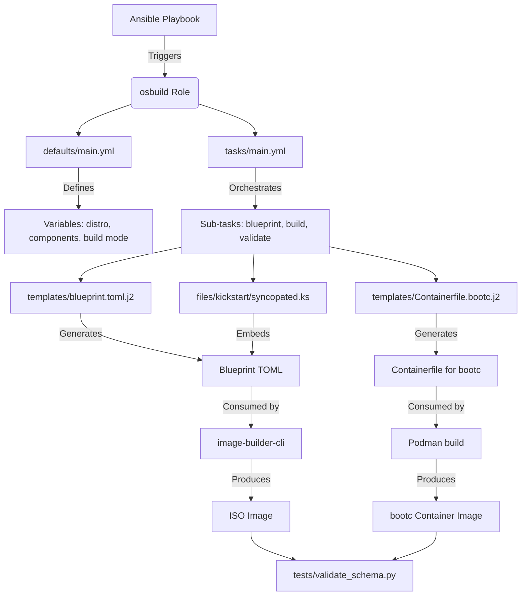

This page provides a **structural overview** of the `osbuild` Ansible role, explaining the purpose, relationships, and key implementation details of its directories and files. It is designed for developers who need to **navigate, modify, or extend** the role with confidence.

Understanding the repository structure is foundational for all subsequent tasks, from customizing blueprints to debugging build failures. This document avoids implementation details that belong to other pages (e.g., blueprint syntax, kickstart logic) and instead focuses on **how the pieces fit together**.

---

## 1. High-Level Repository Architecture

The `osbuild` role follows a **modular, component-driven architecture** centered around **Ansible’s role conventions**, extended with custom patterns for image building. The structure is optimized for:

- **Separation of concerns**: Configuration, logic, templates, and tests are isolated.
- **Extensibility**: New distributions, components, or build modes can be added without refactoring.
- **Testability**: Unit and integration tests are co-located with the logic they verify.

Below is a **Mermaid diagram** of the repository’s architectural flow:



**Key Insight**:
The role supports **two build modes** — traditional ISO-based images and modern `bootc` container images — using a **unified variable interface**. The mode is selected via the `osbuild_build_bootc` variable, which triggers conditional logic in tasks and templates.

Sources: [tasks/main.yml](tasks/main.yml#L1-L50), [defaults/main.yml](defaults/main.yml#L20-L80), [docs/ARCHITECTURAL_REVIEW.md](docs/ARCHITECTURAL_REVIEW.md#L45-L60)

---

## 2. Directory Structure Breakdown

The following table provides a **functional mapping** of each directory, its purpose, and key files:

| Directory | Purpose | Key Files | Relationship to Other Directories |
|---------|--------|---------|----------------------------------|
| **`defaults/`** | Default variable definitions. Acts as the **source of truth** for configuration. | `main.yml` | Consumed by `tasks/`, `templates/`, and `vars/`. Overridable via playbooks. |
| **`tasks/`** | Ansible task files. Orchestrates the build process. | `main.yml`, `blueprint.yml`, `build.yml`, `bootc.yml`, `select_build_mode.yml` | Uses variables from `defaults/` and `vars/`. Renders templates from `templates/`. |
| **`templates/`** | Jinja2 templates for dynamic file generation. | `blueprint.toml.j2`, `Containerfile.bootc.j2`, `kickstart.toml.j2`, `disk.toml.j2` | Rendered by `tasks/blueprint.yml` and `tasks/bootc.yml`. |
| **`files/`** | Static assets embedded into images. | `kickstart/syncopated.ks`, `firstboot/syncopated-firstboot`, `almalinux/10/`, `fedora/43/` | Referenced in blueprints and kickstart templates. |
| **`vars/`** | Distribution-specific variables. | `AlmaLinux.yml`, `Fedora.yml`, `Rocky.yml`, `packages.yml` | Loaded dynamically based on `osbuild_distro`. Extends `defaults/`. |
| **`meta/`** | Role metadata for Ansible Galaxy. | `main.yml` | Defines role dependencies, platforms, and author info. |
| **`handlers/`** | Event-driven tasks (e.g., restart services). | `main.yml` | Rarely used in this role; reserved for future extensibility. |
| **`tests/`** | Validation and testing logic. | `validate_schema.py`, `kickstart.bats`, `firstboot.bats`, `validate_build_modes.yml` | Validates outputs from `tasks/` and `templates/`. |
| **`docs/`** | Architectural and migration documentation. | `ARCHITECTURAL_REVIEW.md`, `MIGRATION_LOG.md` | Explains design decisions and upgrade paths. |

Sources: [Directory Structure](#), [meta/main.yml](meta/main.yml#L1-L33), [tests/validate_schema.py](tests/validate_schema.py#L1-L30)

---

## 3. Key Files Explained

### 3.1 `defaults/main.yml`
**Purpose**: Defines **global default variables** for the role, including build configuration, blueprint metadata, and compatibility flags.

**Key Variables**:
- `osbuild_distro`: Target distribution (e.g., `fedora-43`, `almalinux-10.2`).
- `osbuild_arch`: CPU architecture (`x86_64`, `aarch64`).
- `osbuild_components`: List of components to include (e.g., `gnome`, `nvidia`, `cuda`).
- `osbuild_build_bootc`: Boolean flag to enable `bootc` container image mode.
- `osbuild_only_generate`: If `true`, generates build scripts without executing them.

**Architectural Insight**:
This file uses **backward-compatibility variables** (e.g., `osbuild_image_type`) to support legacy playbooks while encouraging migration to `image-builder-cli` types. It also defines **conditional defaults** based on the build host’s distribution.

Sources: [defaults/main.yml](defaults/main.yml#L1-L80)

---

### 3.2 `tasks/main.yml`
**Purpose**: **Entry point** for the role. Orchestrates the build process by including sub-tasks based on build mode.

**Key Logic**:
1. **Validation**: Checks for required variables and OS compatibility.
2. **Mode Selection**: Uses `select_build_mode.yml` to determine whether to build a traditional ISO or `bootc` container.
3. **Task Inclusion**: Dynamically includes `blueprint.yml`, `build.yml`, or `bootc.yml` based on mode.

**Example Flow**:
```yaml
- name: Select build mode
  ansible.builtin.include_tasks: select_build_mode.yml
  tags: ["osbuild"]
```

**Architectural Insight**:
The role uses **task inclusion** rather than conditional execution to improve readability and maintainability. Each sub-task is self-contained and testable.

Sources: [tasks/main.yml](tasks/main.yml#L1-L50), [tasks/select_build_mode.yml](tasks/select_build_mode.yml)

---

### 3.3 `templates/blueprint.toml.j2`
**Purpose**: Jinja2 template for generating **blueprint files** in TOML format, which define the content and customizations of the image.

**Key Sections**:
- **Metadata**: `name`, `description`, `version`, `distro`.
- **Package Groups**: Dynamically populated from `osbuild_components`.
- **Packages**: Individual packages from component definitions.
- **Customizations**: User accounts, kernel arguments, services, and filesystem layout.

**Dynamic Generation**:
The template iterates over `osbuild_components` and pulls package lists and groups from `osbuild_component_defs` (defined in `defaults/main.yml`).

**Example**:
```toml



[[packages]]
name = "{{ package }}"



```

Sources: [templates/blueprint.toml.j2](templates/blueprint.toml.j2#L1-L30), [defaults/main.yml](defaults/main.yml#L100-L200)

---

### 3.4 `files/kickstart/syncopated.ks`
**Purpose**: **Kickstart file** for automated installation. Embedded into blueprints via `[customizations.installer.kickstart]`.

**Key Features**:
- **Dynamic Disk Selection**: Uses `%pre` scripts to select the largest NVMe disk.
- **Partitioning**: Configurable via `osbuild_kickstart_*` variables.
- **Firstboot Disabled**: Uses `firstboot --disable` to defer post-install tasks to `firstboot` scripts.

**Architectural Insight**:
The kickstart file is **static but parameterized** via environment variables set by the role. This avoids Jinja2 templating in kickstart files, which can conflict with TOML syntax.

Sources: [files/kickstart/syncopated.ks](files/kickstart/syncopated.ks#L1-L30), [tasks/blueprint.yml](tasks/blueprint.yml#L50-L80)

---

### 3.5 `vars/AlmaLinux.yml` (and Similar)
**Purpose**: **Distribution-specific variables**, including repository configurations and GPG keys.

**Key Structure**:
- **Repository Definitions**: Metalinks, base URLs, and GPG key paths.
- **GPG Strategy**: Prefers `file://` URLs for bundled keys and `https://` for remote keys.

**Example**:
```yaml
repo:
  almalinux-baseos:
    metalink: "https://mirrors.almalinux.org/metalink?repo=baseos-{{ _distro_version }}&arch={{ osbuild_arch }}"
    gpgkey_url: "file:///usr/share/distribution-gpg-keys/alma/RPM-GPG-KEY-AlmaLinux-{{ _distro_major_version }}"
    check_gpg: true
```

**Architectural Insight**:
Variables are loaded dynamically using `ansible.builtin.include_vars` based on `osbuild_distro`. This allows the role to support multiple distributions without conditional logic in tasks.

Sources: [vars/AlmaLinux.yml](vars/AlmaLinux.yml#L1-L30), [tasks/repo_keys.yml](tasks/repo_keys.yml)

---

### 3.6 `tests/validate_schema.py`
**Purpose**: **Schema validation** for component definitions in `defaults/main.yml`.

**Key Features**:
- Validates required fields (`label`, `packages`, `blueprint_groups`, etc.).
- Allows Jinja2 expressions in list fields (e.g., `{{ osbuild_nvidia_packages }}`).
- Outputs a summary of all components and their validity.

**Architectural Insight**:
This script ensures that component definitions adhere to the expected schema before the role is executed, preventing runtime errors.

Sources: [tests/validate_schema.py](tests/validate_schema.py#L1-L30), [defaults/main.yml](defaults/main.yml#L100-L200)

---

## 4. Relationships Between Key Files

The following table summarizes the **data flow** between key files:

| Source File | Produces/Consumes | Target File | Purpose |
|-----------|------------------|------------|--------|
| `defaults/main.yml` | Defines | `osbuild_components`, `osbuild_distro` | Global configuration |
| `defaults/main.yml` | Defines | `osbuild_component_defs` | Component metadata |
| `tasks/main.yml` | Includes | `tasks/blueprint.yml` | Blueprint generation |
| `tasks/blueprint.yml` | Renders | `templates/blueprint.toml.j2` | Generates TOML blueprint |
| `templates/blueprint.toml.j2` | Embeds | `files/kickstart/syncopated.ks` | Kickstart automation |
| `tasks/build.yml` | Executes | `image-builder-cli` | Builds ISO image |
| `vars/AlmaLinux.yml` | Extends | `defaults/main.yml` | Distribution-specific repos |
| `tests/validate_schema.py` | Validates | `defaults/main.yml` | Schema compliance |

---

## 5. Next Steps

Now that you understand the repository structure, you can explore deeper topics:

- **[Default Variables and Overrides in `defaults/main.yml`](9-default-variables-and-overrides-in-defaults-main-yml)**: Learn how to customize the role for your use case.
- **[Understanding Blueprints: Definition and Customization](6-understanding-blueprints-definition-and-customization)**: Dive into blueprint syntax and component selection.
- **[Build Modes: Selecting and Configuring for Your Use Case](8-build-modes-selecting-and-configuring-for-your-use-case)**: Compare traditional ISO and `bootc` container modes.
- **[Testing Framework: BATS and Python Tests](20-testing-framework-bats-and-python-tests)**: Learn how to validate your changes.