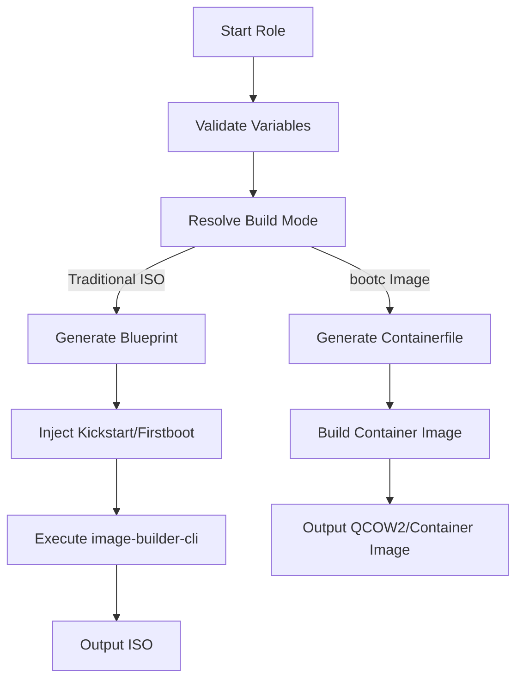

This page introduces the fundamental concepts of **image building** using the OSBuild role in this repository. It explains what image building is, why it is valuable, and how this role abstracts the complexity of generating custom Linux images for Fedora, AlmaLinux, and Rocky Linux distributions.

If you are new to image building, this document will help you understand the **core workflows**, **key components**, and **build modes** supported by this role. For hands-on guidance, proceed to the suggested next steps at the end of this page.

---

## What is Image Building?

**Image building** is the process of creating a **pre-configured, reproducible, and deployable** operating system image. An image is a self-contained file (e.g., `.iso`, `.qcow2`, or container image) that includes the operating system, applications, configurations, and data required to boot and run a system.

### Why Use Image Building?
- **Reproducibility**: Every build produces the same output, eliminating "works on my machine" issues.
- **Customization**: Tailor the operating system to include only the packages, services, and configurations you need.
- **Automation**: Integrate image building into CI/CD pipelines for consistent deployments.
- **Security**: Harden images at build time, reducing runtime configuration drift.
- **Efficiency**: Deploy pre-configured systems in seconds, rather than installing and configuring each system individually.

---

## Core Concepts in This Role

### 1. **Blueprints: The Foundation of Your Image**
A **blueprint** is a declarative configuration file (in [TOML](https://toml.io/) format) that defines the contents and customizations of your image. It specifies:
- Packages and package groups to install.
- Services to enable.
- Kernel arguments.
- Files to inject.
- Timezone, locale, and keyboard settings.
- Customizations for the installer (e.g., Anaconda).

In this role, blueprints are **dynamically generated** using Jinja2 templates, allowing you to customize them without writing TOML manually. For example, the `gnome` component adds the GNOME desktop environment and its dependencies to the blueprint.

**Example Blueprint Snippet**:
```toml
[[packages]]
name = "podman"
version = "*"

[[packages]]
name = "buildah"
version = "*"

[customizations.services]
enabled = ["podman", "cockpit"]
```
Sources: [templates/blueprint.toml.j2](templates/blueprint.toml.j2#L28-L36), [tasks/blueprint.yml](tasks/blueprint.yml#L5-L23)

---

### 2. **Components: Modular Building Blocks**
This role uses a **component-based architecture** to define what gets included in your image. Each component is a self-contained unit that specifies:
- Packages to install.
- Services to enable.
- Kernel arguments.
- Files to inject.
- Dependencies on other components.

**Example Components**:
| Component Name | Description | Example Packages |
|----------------|-------------|------------------|
| `base` | Core system packages (kernel, systemd, NetworkManager) | `kernel`, `systemd`, `NetworkManager` |
| `gnome` | GNOME desktop environment | `gnome-shell`, `gdm`, `nautilus` |
| `nvidia` | NVIDIA proprietary driver and CUDA stack | `akmod-nvidia`, `cuda`, `nvidia-container-toolkit` |
| `container-tools` | Podman, Buildah, and Skopeo | `podman`, `buildah`, `skopeo` |

Components are selected in the `osbuild_components` variable in [`defaults/main.yml`](defaults/main.yml#L172-L180). For example:
```yaml
osbuild_components:
  - base
  - gnome
  - nvidia
  - container-tools
```

---

### 3. **Build Modes: ISO vs. bootc**
This role supports **two distinct build modes**, each serving different use cases:

| Build Mode | Description | Output | Use Case |
|------------|-------------|--------|----------|
| **Traditional ISO** | Creates a bootable `.iso` file using `image-builder-cli`. The ISO includes the Anaconda installer, allowing you to install the system on bare metal or virtual machines. | `.iso` file | Traditional installations, compatibility with existing workflows. |
| **bootc Container Image** | Creates a **container image** using `podman build` and the `bootc` tool. The image can be deployed as a container or converted to a disk image (e.g., `.qcow2`). | Container image (OCI) or `.qcow2` | Immutable infrastructure, cloud deployments, edge devices. |

The build mode is determined by the `osbuild_build_bootc` variable:
- If `true`, the role builds a **bootc container image**.
- If `false`, the role builds a **traditional ISO**.

Sources: [tasks/select_build_mode.yml](tasks/select_build_mode.yml#L15-L22), [defaults/main.yml](defaults/main.yml#L52-L54)

---

### 4. **Kickstart Files: Automating Installations**
A **kickstart file** is a script used by the Anaconda installer to automate the installation process. It defines:
- Disk partitioning.
- User creation.
- Package selection.
- Post-installation scripts.

In this role, kickstart files are **injected into the blueprint** and used during the ISO build process. For example, the `syncopated.ks` kickstart file automates the installation of the system with minimal user interaction.

**Example Kickstart Snippet**:
```kickstart
# Automatically partition the disk
autopart --type=lvm --fstype=xfs

# Create a user
user --name=syncopated --groups=wheel --password=$6$rounds=4096$...

# Enable firstboot scripts
%post
systemctl enable syncopated-firstboot.service
%end
```
Sources: [files/kickstart/syncopated.ks](files/kickstart/syncopated.ks), [tasks/blueprint.yml](tasks/blueprint.yml#L58-L123)

---

### 5. **Firstboot Scripts: Post-Installation Tasks**
**Firstboot scripts** are executed the first time a system boots after installation. They are used to:
- Configure users.
- Set up services.
- Inject files.
- Perform one-time setup tasks.

In this role, firstboot scripts are **injected into the blueprint** and executed automatically after the system is installed from the ISO. For example, the `syncopated-firstboot` script configures the system for the first user.

**Example Firstboot Script**:
```bash
#!/bin/bash
# Configure GNOME for the first user
gsettings set org.gnome.desktop.interface enable-animations false
gsettings set org.gnome.desktop.peripherals.touchpad tap-to-click true
```
Sources: [files/firstboot/syncopated-firstboot](files/firstboot/syncopated-firstboot), [tasks/blueprint.yml](tasks/blueprint.yml#L29-L52)

---

## How the Role Works: A High-Level Overview

The following diagram illustrates the **core workflow** of the OSBuild role:



### Key Phases:
1. **Infrastructure Setup**:
   - Install required packages (`image-builder-cli`, `podman`, etc.).
   - Configure repositories and GPG keys.
   Sources: [tasks/install.yml](tasks/install.yml), [tasks/main.yml](tasks/main.yml#L95-L107)

2. **Blueprint Preparation**:
   - Generate the blueprint from Jinja2 templates.
   - Inject kickstart and firstboot scripts.
   Sources: [tasks/blueprint.yml](tasks/blueprint.yml), [templates/blueprint.toml.j2](templates/blueprint.toml.j2)

3. **Build Execution**:
   - Run `image-builder-cli` (for ISO builds) or `podman build` (for bootc builds).
   - Output the final image (`.iso`, `.qcow2`, or container image).
   Sources: [tasks/build.yml](tasks/build.yml), [tasks/bootc.yml](tasks/bootc.yml)

---

## Example: Building a Traditional ISO

Here’s a simplified example of how the role builds a **traditional ISO**:

1. **Select Components**:
   The `osbuild_components` variable defines what to include in the image.
   ```yaml
   osbuild_components:
     - base
     - gnome
     - nvidia
   ```

2. **Generate Blueprint**:
   The role renders the blueprint template (`blueprint.toml.j2`) and injects the selected components.
   ```toml
   [[packages]]
   name = "gnome-shell"
   version = "*"

   [[packages]]
   name = "akmod-nvidia"
   version = "*"

   [customizations.services]
   enabled = ["gdm", "nvidia-persistenced"]
   ```

3. **Inject Kickstart**:
   The role appends the kickstart file to the blueprint, enabling automated installation.
   ```toml
   [customizations.installer.kickstart]
   contents = '''
   autopart --type=lvm
   user --name=syncopated --groups=wheel
   '''
   ```

4. **Execute Build**:
   The role runs `image-builder-cli` to generate the ISO.
   ```bash
   image-builder build minimal-installer \
     --distro fedora-43 \
     --blueprint custom.toml \
     --output-directory /output
   ```

5. **Output**:
   The final ISO is saved to the output directory, ready for deployment.

Sources: [tasks/build.yml](tasks/build.yml#L36-L49), [tasks/blueprint.yml](tasks/blueprint.yml#L5-L23)

---

## Example: Building a bootc Container Image

Here’s a simplified example of how the role builds a **bootc container image**:

1. **Select Components**:
   The `osbuild_components` variable defines what to include in the image.
   ```yaml
   osbuild_components:
     - base
     - container-tools
   ```

2. **Generate Containerfile**:
   The role renders the `Containerfile.bootc.j2` template.
   ```dockerfile
   FROM fedora-bootc:43

   RUN dnf5 install -y podman buildah skopeo
   RUN systemctl enable podman
   ```

3. **Build Container Image**:
   The role runs `podman build` to create the container image.
   ```bash
   podman build -t my-bootc-image -f Containerfile.bootc
   ```

4. **Output**:
   The final container image is saved and can be deployed as a container or converted to a `.qcow2` file.

Sources: [tasks/bootc.yml](tasks/bootc.yml), [templates/Containerfile.bootc.j2](templates/Containerfile.bootc.j2)

---

## Key Variables for Customization

The following table lists the **most important variables** you can customize to control the image build process:

| Variable | Description | Default Value | Example |
|----------|-------------|---------------|---------|
| `osbuild_distro` | Target distribution and version. | `"fedora-43"` | `"almalinux-10.2"` |
| `osbuild_components` | List of components to include in the image. | `["base", "gnome", "nvidia"]` | `["base", "sway", "container-tools"]` |
| `osbuild_blueprint_name` | Name of the blueprint (used for output files). | `"custom"` | `"my-workstation"` |
| `osbuild_image_type` | Type of image to build (ISO only). | `"minimal-installer"` | `"image-installer"` |
| `osbuild_build_bootc` | Whether to build a bootc container image. | `false` | `true` |
| `osbuild_output_dir` | Directory to save the output image. | `"/var/lib/osbuild/output"` | `"/home/user/builds"` |

Sources: [defaults/main.yml](defaults/main.yml#L14-L54)

---

## Next Steps

Now that you understand the core concepts of image building with OSBuild, here are the next pages to explore:

1. **[Understanding Blueprints: Definition and Customization](6-understanding-blueprints-definition-and-customization)**
   Learn how to define and customize blueprints for your images.

2. **[Kickstart Files: Automation and Configuration](7-kickstart-files-automation-and-configuration)**
   Dive deeper into kickstart files and how they automate the installation process.

3. **[Build Modes: Selecting and Configuring for Your Use Case](8-build-modes-selecting-and-configuring-for-your-use-case)**
   Explore the differences between traditional ISO and bootc container image builds, and how to choose the right mode for your needs.

4. **[Quick Start: Setting Up and Running Your First Build](2-quick-start-setting-up-and-running-your-first-build)**
   Follow a step-by-step guide to set up the role and run your first build.