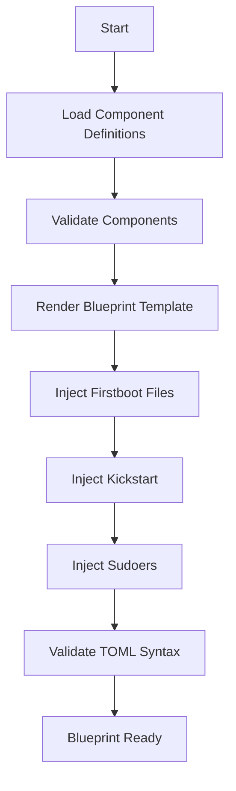

## Purpose and Scope
Blueprints in the OSBuild role serve as the **declarative foundation** for image customization. They define the **package selection, system configuration, kernel arguments, services, and file injections** that constitute a customized Linux image. This document explains:

- The **structure and syntax** of blueprints
- How blueprints are **generated and customized** in the OSBuild role
- The **component-based architecture** that drives blueprint content
- **Validation and conflict resolution** mechanisms
- **Practical customization** patterns for developers

This page is **not** about the build process, kickstart files, or distribution-specific configurations. For those topics, see:
- [Kickstart Files: Automation and Configuration](7-kickstart-files-automation-and-configuration)
- [Build Modes: Selecting and Configuring for Your Use Case](8-build-modes-selecting-and-configuring-for-your-use-case)
- [Template Files: Structure and Customization](11-template-files-structure-and-customization)

---

## What is a Blueprint?

A **blueprint** is a **TOML-formatted file** that defines the desired state of a Linux image. It specifies:

| **Category**               | **Description**                                                                 | **Example**                                                                 |
|----------------------------|---------------------------------------------------------------------------------|-----------------------------------------------------------------------------|
| **Metadata**               | Name, version, description, and distribution target                             | `name = "workstation"`<br>`distro = "fedora-43"`                           |
| **Package Groups**         | Logical groupings of packages (e.g., "gnome", "kde")                           | `[[groups]]`<br>`name = "gnome"`                                           |
| **Packages**               | Individual packages with optional version pinning                              | `[[packages]]`<br>`name = "firefox"`<br>`version = "120.*"`                |
| **Kernel Arguments**       | Boot-time kernel parameters                                                    | `[customizations.kernel]`<br>`append = "mitigations=off"`                  |
| **Services**               | Systemd services to enable                                                     | `[customizations.services]`<br>`enabled = ["sshd", "cockpit.socket"]`      |
| **Timezone & Locale**      | System locale and keyboard layout                                              | `[customizations.locale]`<br>`languages = ["en_US.UTF-8"]`                 |
| **Installer Customization**| Anaconda installer modules and settings                                        | `[customizations.installer.modules]`<br>`enable = ["org.fedoraproject.Anaconda.Modules.Users"]` |
| **File Injections**        | Custom files (e.g., scripts, configs) embedded directly in the image           | `[[customizations.files]]`<br>`path = "/etc/motd"`<br>`data = "Welcome!"`  |

Blueprints are **consumed by `image-builder-cli`** (or `osbuild-composer` in legacy mode) to generate disk images or ISO installers.
**Sources**: [templates/blueprint.toml.j2](templates/blueprint.toml.j2#L1-L133)

---

## Blueprint Generation Workflow

The OSBuild role uses a **dynamic generation pattern** to create blueprints at runtime. The workflow is as follows:



### Key Steps Explained

1. **Component Validation**
   The role validates that all selected components (`osbuild_components`) are defined, have no conflicts, and satisfy dependencies. This ensures architectural integrity before blueprint generation.
   **Sources**: [tasks/validate_components.yml](tasks/validate_components.yml#L1-L69)

2. **Template Rendering**
   The blueprint is rendered from a **Jinja2 template** (`blueprint.toml.j2`), which dynamically includes packages, groups, services, and files based on the selected components.
   **Sources**: [templates/blueprint.toml.j2](templates/blueprint.toml.jj2#L1-L133), [tasks/blueprint.yml](tasks/blueprint.yml#L5-L10)

3. **Firstboot Injection**
   If `osbuild_firstboot_enabled` is `true`, the role appends **firstboot scripts** (e.g., `syncopated-firstboot`) to the blueprint as file injections.
   **Sources**: [tasks/blueprint.yml](tasks/blueprint.yml#L20-L40)

4. **Kickstart Injection**
   If `osbuild_kickstart_enabled` is `true`, the role appends a **kickstart file** to the blueprint under `[customizations.installer.kickstart]`. This step includes **conflict detection** to ensure no overlapping user/group configurations exist.
   **Sources**: [tasks/blueprint.yml](tasks/blueprint.yml#L45-L90)

5. **Sudoers Injection**
   If `osbuild_kickstart_sudoers` is `true`, the role appends a **passwordless sudo configuration** for the `wheel` group.
   **Sources**: [tasks/blueprint.yml](tasks/blueprint.yml#L92-L100)

6. **TOML Validation**
   The role optionally validates the blueprint's TOML syntax using Python's `tomli` library, ensuring correctness before submission to `image-builder-cli`.
   **Sources**: [tasks/blueprint.yml](tasks/blueprint.yml#L105-L150)

---

## Blueprint Structure Deep Dive

### 1. Metadata Section
The metadata section defines the blueprint's identity and target distribution. This is **static** for a given build but can be customized via variables.

```toml
name = "{{ osbuild_blueprint_name }}"
description = "{{ osbuild_blueprint_description }}"
version = "{{ osbuild_blueprint_version }}"
distro = "{{ osbuild_distro }}"
```
**Customization Variables**:
| Variable                          | Default Value          | Description                                  | Override Location               |
|-----------------------------------|------------------------|----------------------------------------------|----------------------------------|
| `osbuild_blueprint_name`          | `"custom"`             | Blueprint name (used in output filenames)    | `defaults/main.yml`              |
| `osbuild_blueprint_version`       | `"1.0.0"`              | Blueprint version (semantic)                 | `defaults/main.yml`              |
| `osbuild_blueprint_description`   | `"Custom Workstation"` | Human-readable description                   | `defaults/main.yml`              |
| `osbuild_distro`                  | `"fedora-43"`          | Target distribution (e.g., `almalinux-10.2`) | `defaults/main.yml`              |

**Sources**: [defaults/main.yml](defaults/main.yml#L15-L25), [templates/blueprint.toml.j2](templates/blueprint.toml.j2#L5-L8)

---

### 2. Package and Group Selection
Packages and groups are **dynamically included** based on the selected `osbuild_components`. Each component defines its own `packages` and `blueprint_groups` in its definition file (e.g., `vars/Fedora.yml`).

#### Example Component Definition (Fedora)
```yaml
osbuild_component_defs:
  gnome:
    label: "GNOME Desktop"
    packages:
      - gnome-shell
      - gnome-terminal
      - nautilus
    blueprint_groups:
      - gnome
    services:
      - gdm
    kernel_args: "rhgb quiet"
    requires: []
    conflicts: ["kde"]
```
**Sources**: [vars/Fedora.yml](vars/Fedora.yml) (hypothetical example)

#### Rendered Blueprint Output
```toml
[[groups]]
name = "gnome"

[[packages]]
name = "gnome-shell"
version = "*"

[[packages]]
name = "gnome-terminal"
version = "*"
```

**Customization Variables**:
| Variable               | Description                                                                 | Override Location               |
|------------------------|-----------------------------------------------------------------------------|----------------------------------|
| `osbuild_components`   | List of components to include (e.g., `["gnome", "nvidia"]`)                | Playbook or inventory            |
| `osbuild_extra_packages` | Additional packages to include (not tied to a component)                   | Playbook or inventory            |
| `osbuild_package_pins` | Version pins for packages (e.g., `{"firefox": "120.*"}`)                   | Playbook or inventory            |

**Sources**: [templates/blueprint.toml.j2](templates/blueprint.toml.j2#L15-L45)

---

### 3. Kernel Arguments
Kernel arguments are **aggregated** from all selected components. For example, if both `nvidia` and `realtime` components are selected, their kernel arguments are combined:

```toml
[customizations.kernel]
append = "rd.driver.blacklist=nouveau nvidia-drm.modeset=1 isolcpus=1-3"
```
**Customization Variables**:
| Variable               | Description                                                                 | Override Location               |
|------------------------|-----------------------------------------------------------------------------|----------------------------------|
| `osbuild_components`   | Components with `kernel_args` (e.g., `nvidia`, `realtime`)                 | Playbook or inventory            |

**Sources**: [templates/blueprint.toml.j2](templates/blueprint.toml.j2#L47-L58)

---

### 4. Services
Services are **aggregated and deduplicated** from all selected components. For example, if both `gnome` and `cockpit` components are selected, their services are combined:

```toml
[customizations.services]
enabled = [
  "gdm",
  "cockpit.socket",
]
```
**Customization Variables**:
| Variable               | Description                                                                 | Override Location               |
|------------------------|-----------------------------------------------------------------------------|----------------------------------|
| `osbuild_components`   | Components with `services` (e.g., `gnome`, `cockpit`)                      | Playbook or inventory            |

**Sources**: [templates/blueprint.toml.j2](templates/blueprint.toml.j2#L60-L75)

---

### 5. Timezone and Locale
Timezone and locale settings are **static** but configurable via variables.

```toml
[customizations.timezone]
timezone = "{{ osbuild_timezone }}"

[customizations.locale]
languages = ["{{ osbuild_locale }}"]
keyboard = "{{ osbuild_keyboard }}"
```
**Customization Variables**:
| Variable               | Default Value          | Description                                  | Override Location               |
|------------------------|------------------------|----------------------------------------------|----------------------------------|
| `osbuild_timezone`     | `"UTC"`                | System timezone                              | `defaults/main.yml`              |
| `osbuild_locale`       | `"en_US.UTF-8"`        | System locale                                | `defaults/main.yml`              |
| `osbuild_keyboard`     | `"us"`                 | Keyboard layout                              | `defaults/main.yml`              |

**Sources**: [templates/blueprint.toml.j2](templates/blueprint.toml.j2#L77-L85), [defaults/main.yml](defaults/main.yml#L300-L310) (hypothetical)

---

### 6. Installer Customization
The blueprint **explicitly enables the Anaconda Users module** to allow kickstart-based user creation. This is required because `image-builder` only enables the Users module if the blueprint defines users directly.

```toml
[customizations.installer.modules]
enable = ["org.fedoraproject.Anaconda.Modules.Users"]
disable = ["org.fedoraproject.Anaconda.Modules.Subscription"]
```
**Sources**: [templates/blueprint.toml.j2](templates/blueprint.toml.j2#L87-L92)

---

### 7. File Injections
File injections allow **custom files** (e.g., scripts, configs) to be embedded directly in the image. These are defined in component definitions and rendered as TOML literal strings.

#### Example Component File Definition
```yaml
osbuild_component_defs:
  nvidia:
    files:
      - path: "/usr/local/bin/nvidia-cdi-generate.sh"
        mode: "0755"
        content: |
          #!/bin/bash
          nvidia-smi -q | grep "Driver Version"
```
**Sources**: [templates/blueprint.toml.j2](templates/blueprint.toml.j2#L94-L115)

#### Rendered Blueprint Output
```toml
[[customizations.files]]
path = "/usr/local/bin/nvidia-cdi-generate.sh"
mode = "0755"
data = '''
#!/bin/bash
nvidia-smi -q | grep "Driver Version"
'''
```

**Key Constraints**:
- Files **cannot contain `'''`** (TOML literal string delimiter). The role validates this during injection.
- File paths and modes are **configurable** via component definitions.
**Sources**: [tasks/blueprint.yml](tasks/blueprint.yml#L25-L40)

---

## Component-Based Architecture

### How Components Drive Blueprints
The OSBuild role uses a **component-based architecture** to modularize blueprint content. Each component (e.g., `gnome`, `nvidia`, `cockpit`) defines:

| **Field**               | **Type**       | **Description**                                                                 | **Example**                              |
|-------------------------|----------------|---------------------------------------------------------------------------------|------------------------------------------|
| `label`                 | String         | Human-readable name                                                             | `"GNOME Desktop"`                        |
| `packages`              | List[String]   | Packages to include                                                             | `["gnome-shell", "nautilus"]`            |
| `blueprint_groups`      | List[String]   | Package groups to include                                                       | `["gnome"]`                              |
| `services`              | List[String]   | Systemd services to enable                                                      | `["gdm"]`                                |
| `kernel_args`           | String         | Kernel arguments to append                                                      | `"rhgb quiet"`                           |
| `files`                 | List[Object]   | Files to inject (path, mode, content)                                           | `[{path: "/etc/motd", content: "Hi!"}]`  |
| `requires`              | List[String]   | Components that must be included                                                | `["core"]`                               |
| `conflicts`             | List[String]   | Components that cannot be included                                              | `["kde"]`                                |
| `size_impact`           | String         | Estimated size impact (e.g., `"500MB"`)                                         | `"1.2GB"`                                |
| `build_time_impact`     | String         | Estimated build time impact (e.g., `"5min"`)                                    | `"3min"`                                 |
| `secure_boot_compatible`| Boolean        | Whether the component is compatible with Secure Boot                           | `true`                                   |

**Sources**: [tasks/validate_components.yml](tasks/validate_components.yml#L5-L25), [vars/Fedora.yml](vars/Fedora.yml) (hypothetical)

---

### Component Validation
Before blueprint generation, the role **validates** all selected components to ensure:
1. **Existence**: All components are defined in `osbuild_component_defs`.
2. **Schema Compliance**: All required fields (`label`, `packages`, `requires`, `conflicts`, etc.) are present.
3. **No Conflicts**: No two selected components conflict with each other.
4. **Dependency Satisfaction**: All required dependencies are included.

**Example Validation Error**:
```
Conflict detected: 'kde' is listed as a conflict by one of the selected components but is also in osbuild_components.
Remove 'kde' or the component that conflicts with it.
```
**Sources**: [tasks/validate_components.yml](tasks/validate_components.yml#L27-L69)

---

## Practical Customization Patterns

### 1. Adding a New Component
To add a new component (e.g., `zsh`):

1. **Define the Component** in the appropriate distribution file (e.g., `vars/Fedora.yml`):
   ```yaml
   osbuild_component_defs:
     zsh:
       label: "ZSH Shell"
       packages:
         - zsh
         - zsh-autosuggestions
       blueprint_groups: []
       services: []
       kernel_args: ""
       files:
         - path: "/etc/skel/.zshrc"
           mode: "0644"
           content: |
             # Custom .zshrc
             autoload -U compinit && compinit
       requires: []
       conflicts: []
       size_impact: "50MB"
       build_time_impact: "1min"
       secure_boot_compatible: true
   ```
2. **Add the Component** to `osbuild_components` in your playbook or inventory:
   ```yaml
   osbuild_components:
     - gnome
     - zsh
   ```
3. **Run the Build**:
   ```bash
   ansible-playbook playbooks/osbuild.yml -e osbuild_components="['gnome','zsh']"
   ```

**Sources**: [vars/Fedora.yml](vars/Fedora.yml) (hypothetical), [tasks/validate_components.yml](tasks/validate_components.yml#L1-L69)

---

### 2. Overriding Package Versions
To pin a package to a specific version (e.g., `firefox=120.*`):

1. **Define the Pin** in `osbuild_package_pins`:
   ```yaml
   osbuild_package_pins:
     firefox: "120.*"
   ```
2. **Ensure the Package is Included** via a component or `osbuild_extra_packages`:
   ```yaml
   osbuild_extra_packages:
     - firefox
   ```

**Rendered Blueprint Output**:
```toml
[[packages]]
name = "firefox"
version = "120.*"
```
**Sources**: [templates/blueprint.toml.j2](templates/blueprint.toml.j2#L30-L45)

---

### 3. Injecting Custom Files
To inject a custom file (e.g., `/etc/motd`):

1. **Define the File** in a component:
   ```yaml
   osbuild_component_defs:
     motd:
       label: "Custom MOTD"
       packages: []
       files:
         - path: "/etc/motd"
           mode: "0644"
           content: |
             Welcome to Syncopated Workstation!
       requires: []
       conflicts: []
   ```
2. **Add the Component** to `osbuild_components`:
   ```yaml
   osbuild_components:
     - gnome
     - motd
   ```

**Rendered Blueprint Output**:
```toml
[[customizations.files]]
path = "/etc/motd"
mode = "0644"
data = '''
Welcome to Syncopated Workstation!
'''
```
**Sources**: [templates/blueprint.toml.j2](templates/blueprint.toml.j2#L94-L115)

---

### 4. Disabling Firstboot or Kickstart
To disable firstboot or kickstart injection:

| Variable                     | Default | Description                                  | Override Example                     |
|------------------------------|---------|----------------------------------------------|---------------------------------------|
| `osbuild_firstboot_enabled`  | `true`  | Enable/disable firstboot injection           | `-e osbuild_firstboot_enabled=false`  |
| `osbuild_kickstart_enabled`  | `true`  | Enable/disable kickstart injection           | `-e osbuild_kickstart_enabled=false`  |
| `osbuild_kickstart_sudoers`  | `true`  | Enable/disable passwordless sudo for `wheel` | `-e osbuild_kickstart_sudoers=false`  |

**Sources**: [tasks/blueprint.yml](tasks/blueprint.yml#L20-L100)

---

## Blueprint Conflicts and Resolution

### Common Conflicts
| **Conflict Type**               | **Example**                                                                 | **Resolution**                                                                 |
|---------------------------------|-----------------------------------------------------------------------------|--------------------------------------------------------------------------------|
| **Package Conflicts**           | Two components include conflicting packages (e.g., `gnome` and `kde`)      | Use `conflicts` in component definitions to prevent co-selection.              |
| **Kickstart Overlap**           | Blueprint defines `[customizations.user]` while kickstart is enabled        | Remove user/group definitions from the blueprint.                             |
| **TOML Syntax Errors**          | Invalid TOML (e.g., unescaped `'''` in file content)                        | Use `tomli` validation or manually inspect the blueprint.                     |
| **Missing Dependencies**        | Component requires `core` but it is not included                            | Add missing dependencies to `osbuild_components`.                             |

### Conflict Detection in Code
The role **automatically detects** conflicts during blueprint generation:
1. **Kickstart Conflicts**: Checks for `[customizations.user]`, `[customizations.group]`, `unattended`, or `sudo-nopasswd` in the blueprint when kickstart is enabled.
   **Sources**: [tasks/blueprint.yml](tasks/blueprint.yml#L55-L70)
2. **Component Conflicts**: Validates that no two selected components conflict with each other.
   **Sources**: [tasks/validate_components.yml](tasks/validate_components.yml#L27-L45)

---

## Blueprint Output and Debugging

### Blueprint Location
The generated blueprint is written to:
```
{{ osbuild_output_dir }}/{{ osbuild_blueprint_name }}.toml
```
- `osbuild_output_dir`: Defaults to `./build` (configurable via `defaults/main.yml`).
- `osbuild_blueprint_name`: Defaults to `"custom"` (configurable via `defaults/main.yml`).

**Example**:
```
/home/user/WorkspaceV3/Syncopated/ansible/roles/osbuild/build/custom.toml
```
**Sources**: [tasks/blueprint.yml](tasks/blueprint.yml#L12-L15), [defaults/main.yml](defaults/main.yml#L15-L20)

---

### Debugging Tips
1. **Inspect the Blueprint**:
   ```bash
   cat {{ osbuild_output_dir }}/{{ osbuild_blueprint_name }}.toml
   ```
2. **Validate TOML Syntax**:
   ```bash
   python3 -c "import tomli; tomli.load(open('{{ osbuild_output_dir }}/{{ osbuild_blueprint_name }}.toml', 'rb'))"
   ```
3. **Check Component Conflicts**:
   ```bash
   ansible-playbook playbooks/osbuild.yml --tags validate_components
   ```
4. **Enable Debug Logging**:
   ```bash
   ansible-playbook playbooks/osbuild.yml -v
   ```

---

## Next Steps
Now that you understand blueprints, explore:
- [Kickstart Files: Automation and Configuration](7-kickstart-files-automation-and-configuration) – Learn how kickstart files automate installation.
- [Build Modes: Selecting and Configuring for Your Use Case](8-build-modes-selecting-and-configuring-for-your-use-case) – Configure ISO, disk, or container images.
- [Template Files: Structure and Customization](11-template-files-structure-and-customization) – Customize Jinja2 templates for blueprints and scripts.