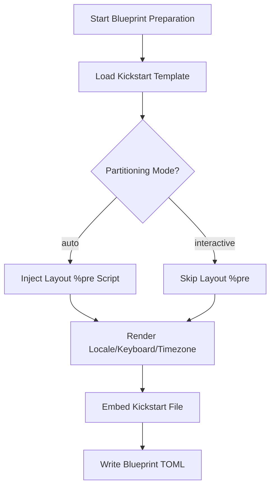

This page explains how **Kickstart files** automate and configure the installation process in the OSBuild role. It covers their structure, integration with Anaconda, disk partitioning logic, and how they are dynamically embedded into blueprints. This documentation is intended for developers who need to customize installation behavior or troubleshoot automated builds.

---

## 1. Core Purpose of Kickstart Files

Kickstart files are **automated installation scripts** used by the Anaconda installer in RHEL-based distributions (Fedora, AlmaLinux, Rocky). They eliminate manual intervention during OS installation by providing predefined answers to installation prompts, such as disk partitioning, package selection, and post-installation tasks.

In this role, Kickstart files serve two primary functions:
- **Automate disk partitioning** with a flexible, size-aware layout algorithm.
- **Configure installer behavior** (e.g., enabling DHCP networking, disabling firstboot, and setting locale/timezone).

The role provides **two variants** of Kickstart files:
1. **`syncopated.ks`**: Fully automated partitioning with a dynamic disk selection algorithm.
2. **`syncopated-interactive.ks`**: Minimal configuration that defers disk selection to the Anaconda GUI.

Sources: [syncopated.ks](files/kickstart/syncopated.ks#L1-L10), [syncopated-interactive.ks](files/kickstart/syncopated-interactive.ks#L1-L12)

---

## 2. Kickstart File Structure and Key Directives

### 2.1. Common Directives (Both Variants)
Both Kickstart files share the following core directives:

| Directive                     | Purpose                                                                                     |
|-------------------------------|---------------------------------------------------------------------------------------------|
| `graphical`                   | Forces the installer to run in graphical mode.                                              |
| `firstboot --disable`         | Disables the firstboot configuration wizard after installation.                             |
| `reboot`                      | Automatically reboots the system after installation completes.                              |
| `network --bootproto=dhcp ...`| Configures the primary network interface with DHCP and activates it on boot.                |

Sources: [syncopated.ks](files/kickstart/syncopated.ks#L11-L17), [syncopated-interactive.ks](files/kickstart/syncstart-interactive.ks#L14-L17)

---

### 2.2. Automated Partitioning (`syncopated.ks`)
The `syncopated.ks` file includes a **`%pre` script** that dynamically selects a target disk and generates a partitioning layout. This script:
- Excludes installation media, removable, read-only, and USB disks.
- Prefers NVMe disks over SATA; among equals, selects the largest disk.
- Validates that the selected disk meets a minimum size requirement (40 GiB by default).
- Generates a **LVM-based layout** with `/`, `/usr`, `/var`, and optionally `/home` logical volumes.

#### Disk Selection Logic
The `%pre` script uses `lsblk`, `findmnt`, and `blkid` to identify candidate disks. It excludes:
- Disks holding the installation media (mounted at `/run/install/repo` or identified by `inst.stage2=hd:LABEL=...`).
- Removable, read-only, or USB disks.
- Loop devices, optical drives (`sr*`), and `zram` devices.

Sources: [syncopated.ks](files/kickstart/syncopated.ks#L19-L99)

#### Partitioning Layout
The layout algorithm divides the disk into:
1. A **2 GiB `/boot` partition** (XFS).
2. A **LVM physical volume** occupying the remaining space.
3. Logical volumes for `/`, `/usr`, and `/var`, with optional `/home` if sufficient space remains.

The algorithm uses the following **configurable parameters** (defaults shown):

| Parameter               | Default Value | Purpose                                                                                     |
|-------------------------|---------------|---------------------------------------------------------------------------------------------|
| `MIN_MIB`               | 40960 (40 GiB)| Minimum disk size required for installation.                                                |
| `BUFFER_MIB`            | 4096 (4 GiB)  | Space reserved for `/boot`, EFI partition, and LVM metadata.                               |
| `ROOT_PCT`              | 10%           | Percentage of usable space allocated to `/`.                                                |
| `ROOT_MIN_MIB`          | 16384 (16 GiB)| Minimum size for `/` (floor).                                                               |
| `RESERVE_PCT`           | 10%           | Percentage of usable space left unassigned in `vg00` for future `lvextend` operations.      |
| `USR_PCT`               | 80%           | Percentage of remaining space (after `/` and reserve) allocated to `/usr`.                  |
| `USR_MAX_MIB`           | 262144 (256 GiB)| Maximum size for `/usr` (cap).                                                             |
| `VAR_MAX_MIB`           | 131072 (128 GiB)| Maximum size for `/var` (cap).                                                             |
| `HOME_MIN_MIB`          | 102400 (100 GiB)| Minimum size required to create a separate `/home` logical volume.                          |

The generated layout is written to `/tmp/partitions.ks` and included in the main Kickstart file via `%include /tmp/partitions.ks`.

Sources: [syncopated.ks](files/kickstart/syncopated.ks#L27-L40), [syncopated.ks](files/kickstart/syncopated.ks#L126-L141)

---

### 2.3. Interactive Partitioning (`syncopated-interactive.ks`)
The `syncopated-interactive.ks` file omits the `%pre` script and partitioning directives entirely. This forces Anaconda to:
- Prompt the user to select disks and configure partitioning in the GUI.
- Require manual completion of **Installation Destination**, **Root Password**, and **User Creation** steps.

This variant is selected by setting `osbuild_kickstart_partitioning: interactive` in the role variables.

Sources: [syncopated-interactive.ks](files/kickstart/syncopated-interactive.ks#L1-L18)

---

## 3. Integration with Blueprints and OSBuild

### 3.1. Dynamic Embedding in Blueprints
Kickstart files are **embedded into blueprints** during the `blueprint.yml` task execution. The `templates/kickstart.toml.j2` template:
- Injects the Kickstart file contents into the `customizations.installer.kickstart.contents` field of the blueprint.
- Prepends **locale, keyboard, and timezone** directives using the `osbuild_locale`, `osbuild_keyboard`, and `osbuild_timezone` variables.
- Conditionally includes a `%pre` script to pass disk layout parameters when `osbuild_kickstart_partitioning: auto`.

## Blueprint Injection Workflow


Sources: [kickstart.toml.j2](templates/kickstart.toml.j2#L1-L26), [blueprint.yml](tasks/blueprint.yml#L1-L50)

---

### 3.2. Role Variables Controlling Kickstart Behavior
The following variables in `defaults/main.yml` control Kickstart file selection and partitioning behavior:

| Variable                          | Default Value       | Purpose                                                                                     |
|-----------------------------------|---------------------|---------------------------------------------------------------------------------------------|
| `osbuild_kickstart_file`          | `syncopated.ks`     | Name of the Kickstart file to use (e.g., `syncopated.ks` or `syncopated-interactive.ks`).   |
| `osbuild_kickstart_partitioning`  | `auto`              | Partitioning mode: `auto` (automated) or `interactive` (GUI).                              |
| `osbuild_kickstart_enabled`       | `true`              | Enables/disables Kickstart injection entirely.                                             |
| `osbuild_locale`                  | `en_US.UTF-8`       | Locale setting for the installed system.                                                    |
| `osbuild_keyboard`                | `us`                | Keyboard layout for the installed system.                                                   |
| `osbuild_timezone`                | `UTC`               | Timezone for the installed system.                                                          |
| `osbuild_kickstart_disk_min_gib`  | `40`                | Minimum disk size required for automated partitioning (GiB).                                |
| `osbuild_kickstart_root_percent`  | `10`                | Percentage of usable space allocated to `/`.                                                |
| `osbuild_kickstart_root_min_gib`  | `16`                | Minimum size for `/` (GiB).                                                                 |
| `osbuild_kickstart_reserve_percent`| `10`               | Percentage of usable space left unassigned in `vg00`.                                       |
| `osbuild_kickstart_usr_percent`   | `80`                | Percentage of remaining space allocated to `/usr`.                                          |
| `osbuild_kickstart_usr_max_gib`   | `256`               | Maximum size for `/usr` (GiB).                                                              |
| `osbuild_kickstart_var_max_gib`   | `128`               | Maximum size for `/var` (GiB).                                                              |
| `osbuild_kickstart_home_min_gib`  | `100`               | Minimum size required to create a separate `/home` logical volume (GiB).                    |

Sources: [defaults/main.yml](defaults/main.yml#L400-L450) *(Note: Exact lines for Kickstart variables may vary; defaults are distributed throughout the file.)*

---

## 4. Testing and Validation

### 4.1. Automated Testing with BATS
The `tests/kickstart/kickstart.bats` file contains **BATS (Bash Automated Testing System)** tests for the `%pre` disk selection and partitioning logic. These tests:
- Stub `lsblk`, `findmnt`, and `blkid` to simulate disk environments.
- Verify disk selection logic (e.g., NVMe preference, exclusion of USB/removable disks).
- Validate partitioning layout calculations for disks of varying sizes.
- Check error handling for undersized disks or missing candidates.

#### Example Test Cases
| Test Case                                      | Purpose                                                                                     |
|------------------------------------------------|---------------------------------------------------------------------------------------------|
| `NVMe wins over a larger SATA disk`            | Ensures NVMe disks are preferred over SATA, even if smaller.                               |
| `USB disks are excluded`                       | Verifies USB disks are excluded from selection.                                             |
| `477 GiB disk caps /usr and /var`              | Validates layout calculations for large disks.                                             |
| `30 GiB disk aborts with error`                | Ensures undersized disks trigger a readable error.                                          |

Sources: [kickstart.bats](tests/kickstart/kickstart.bats#L46-L194)

---

### 4.2. Python-Based Blueprint Validation
The `tests/kickstart/check_kickstart.py` script validates the **rendered blueprints** to ensure:
- Kickstart contents match the expected rendered output (locale/keyboard/timezone + source file).
- The `customizations.installer.kickstart` field is present exactly once when enabled.
- No conflicting directives (e.g., `user`, `group`, `unattended`) are present.
- The Anaconda **Users module** is enabled.
- The **wheel sudoers drop-in** is correctly configured.

The script can optionally run `ksvalidator` to check Kickstart syntax.

Sources: [check_kickstart.py](tests/kickstart/check_kickstart.py#L1-L108)

---

## 5. Customization and Extensibility

### 5.1. Modifying Kickstart Files
To customize Kickstart behavior:
1. **Edit the source files** (`syncopated.ks` or `syncopated-interactive.ks`) in `files/kickstart/`.
   - Avoid introducing **three consecutive single quotes (`'''`)** or **Jinja delimiters (`{{`, `%}`)**, as these break TOML embedding.
2. **Override role variables** in your playbook or inventory to adjust partitioning parameters or locale settings.
3. **Add new Kickstart files** for specialized use cases (e.g., encrypted partitions, custom post-install scripts).

Sources: [syncopated.ks](files/kickstart/syncopated.ks#L6-L7)

---

### 5.2. Adding Post-Installation Logic
To add post-installation tasks:
1. Use the `%post` section in the Kickstart file to run scripts after installation.
   Example:
   ```bash
   %post
   echo "Hello, post-install world!" > /etc/motd
   %end
   ```
2. For complex logic, inject **Systemd services** or **firstboot scripts** via the `firstboot` component. See: [Firstboot Scripts: Injection and Execution](12-firstboot-scripts-injection-and-execution).

---

## 6. Troubleshooting Kickstart Issues

### 6.1. Common Issues and Solutions
| Issue                                      | Cause                                                                                     | Solution                                                                                     |
|--------------------------------------------|-------------------------------------------------------------------------------------------|----------------------------------------------------------------------------------------------|
| **No installable disk found**              | All disks are excluded (e.g., USB, removable, or holding install media).                  | Verify disk eligibility with `lsblk -dno NAME,TYPE,RM,RO,SIZE,TRAN`.                        |
| **Partitioning layout errors**             | Disk too small or layout parameters misconfigured.                                        | Adjust `osbuild_kickstart_disk_min_gib` or layout percentages.                              |
| **Kickstart not injected into blueprint**  | `osbuild_kickstart_enabled: false` or misconfigured template.                             | Set `osbuild_kickstart_enabled: true` and verify `osbuild_kickstart_file`.                  |
| **Anaconda GUI appears despite automation**| Missing or invalid Kickstart directives.                                                  | Ensure `graphical`, `firstboot --disable`, and `reboot` are present.                        |
| **Locale/keyboard/timezone ignored**       | Variables (`osbuild_locale`, etc.) not passed to the role.                                | Verify variable definitions in playbook or inventory.                                       |

---

### 6.2. Debugging the `%pre` Script
To debug the `%pre` script:
1. **Check logs** at `/tmp/syncopated-pre.log` on the installed system.
2. **Stub the environment** in BATS tests to simulate disk configurations.
3. **Manually run the script** in a test VM with the same disk layout.

---

## 7. Next Steps
- **[Build Modes: Selecting and Configuring for Your Use Case](8-build-modes-selecting-and-configuring-for-your-use-case)**: Learn how Kickstart files integrate with traditional ISO and bootc builds.
- **[Firstboot Scripts: Injection and Execution](12-firstboot-scripts-injection-and-execution)**: Extend post-installation automation with firstboot scripts.
- **[Default Variables and Overrides in `defaults/main.yml`](9-default-variables-and-overrides-in-defaults-main-yml)**: Explore all configurable options for Kickstart and partitioning.