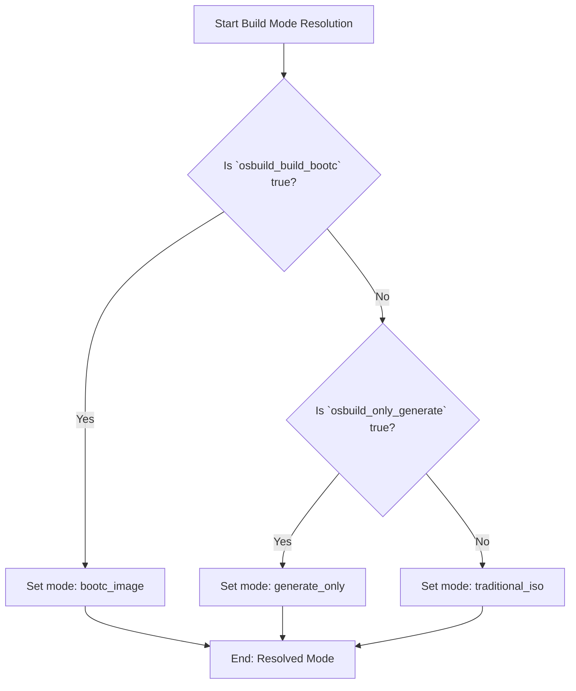

This document explains the **build modes** available in the OSBuild role, how they are selected, and how to configure them for your specific use case. The role supports three distinct build modes, each serving a different workflow: **traditional ISO builds**, **bootc container-based builds**, and **blueprint-only generation**. These modes are designed to accommodate immutable infrastructure patterns, hybrid cloud deployments, and offline build workflows.

---

## Core Build Modes: Overview and Selection Logic

The OSBuild role uses a **priority-based resolution system** to determine the build mode. This system ensures that only one mode is active at a time, preventing ambiguity and ensuring deterministic behavior. The resolution logic is implemented in [`tasks/select_build_mode.yml`](./tasks/select_build_mode.yml#L1-L33) and follows this hierarchy:

## **Build Mode Resolution Flowchart**



### **Priority Order**
1. **`bootc_image`** (highest priority)
   - Activated when `osbuild_build_bootc: true`.
   - Used for **immutable infrastructure** and **atomic OS updates** via bootc containers.
   - Output: A bootable container image and optionally a disk image (QCOW2, ISO, or RAW).

2. **`generate_only`** (default)
   - Activated when `osbuild_build_bootc: false` and `osbuild_only_generate: true`.
   - Used for **offline or air-gapped workflows** where the build host cannot run `image-builder` directly.
   - Output: A blueprint file and a shell script (`build-<blueprint>.sh`) that can be transferred to a build host.

3. **`traditional_iso`** (lowest priority)
   - Activated when `osbuild_build_bootc: false` and `osbuild_only_generate: false`.
   - Used for **traditional ISO-based deployments** (e.g., bare-metal or virtual machine installations).
   - Output: A bootable ISO or disk image (e.g., QCOW2, VMDK).

---

## Build Mode Configuration Variables

The build mode is controlled by two **boolean variables** defined in [`defaults/main.yml`](./defaults/main.yml#L45-L55):

| Variable                  | Type    | Default | Description                                                                                                                                                                                                 |
|---------------------------|---------|---------|-------------------------------------------------------------------------------------------------------------------------------------------------------------------------------------------------------------|
| `osbuild_build_bootc`     | Boolean | `false` | When `true`, builds a **bootc container image** and optionally a bootable disk image. Overrides all other modes.                                                                                           |
| `osbuild_only_generate`   | Boolean | `true`  | When `true` and `osbuild_build_bootc` is `false`, generates **only the blueprint and build script** (no image is built). When `false`, builds a **traditional ISO or disk image** using `image-builder`. |

### **Example: Overriding Build Modes**
To select a specific build mode, override the variables in your playbook or inventory:

```yaml
# Example 1: Build a bootc container image
- hosts: build_host
  vars:
    osbuild_build_bootc: true
    osbuild_bootc_image_name: "my-custom-os"
    osbuild_bootc_image_tag: "latest"
  roles:
    - osbuild

# Example 2: Generate only the blueprint and build script (default)
- hosts: build_host
  vars:
    osbuild_only_generate: true
  roles:
    - osbuild

# Example 3: Build a traditional ISO image
- hosts: build_host
  vars:
    osbuild_only_generate: false
    osbuild_image_type: "minimal-installer"  # or "image-installer" for EL distros
  roles:
    - osbuild
```

---

## Build Mode Deep Dive

### 1. **`bootc_image` Mode**
**Purpose**: Build a **bootable container image** for immutable infrastructure using `bootc` (formerly known as "bootable containers"). This mode is ideal for environments that require atomic updates, rollback capabilities, and declarative system management.

#### **Key Features**
- **Immutable Infrastructure**: Systems are updated atomically by switching to a new container image.
- **Ansible Role Inversion**: Configurations are compiled at **build time** (not runtime) and written to `/usr/etc` (vendor defaults) instead of `/etc`.
- **Multi-Stage Builds**: Separates build tools (e.g., Ansible) from the runtime image to minimize attack surface.
- **NVIDIA GPU Support**: Includes CDI (Container Device Interface) for Podman GPU access.

#### **Workflow**
1. **Containerfile Generation**: A [`Containerfile.bootc.j2`](./templates/Containerfile.bootc.j2) template is rendered to define the container build process.
2. **Build Context**: Ansible playbooks and templates are copied into a build context.
3. **Container Build**: The container image is built using `podman` and tagged for deployment.
4. **Disk Image (Optional)**: A bootable disk image (ISO, QCOW2, or RAW) is generated using `bootc-image-builder`.

#### **Configuration Files**
- **`disk.toml.j2`**: Defines filesystem layout (e.g., root and home partition sizes). [`templates/disk.toml.j2`](./templates/disk.toml.j2#L1-L27)
- **`iso.toml.j2`**: Configures the Anaconda installer for ISO builds. [`templates/iso.toml.j2`](./templates/iso.toml.j2#L1-L32)
- **`Containerfile.bootc.j2`**: Defines the multi-stage container build process. [`templates/Containerfile.bootc.j2`](./templates/Containerfile.bootc.j2#L1-L128)

#### **Example: Bootc Build Task**
The [`tasks/bootc.yml`](./tasks/bootc.yml#L1-L134) file orchestrates the bootc build process:
1. Installs prerequisites (`podman`, `buildah`, `skopeo`).
2. Creates a workspace and templates the `Containerfile`.
3. Builds the container image and optionally a disk image.

---

### 2. **`generate_only` Mode**
**Purpose**: Generate **only the blueprint and build script** without executing the build. This mode is designed for **offline or air-gapped environments** where the build host cannot run `image-builder` directly.

#### **Key Features**
- **Offline Workflows**: The generated `build-<blueprint>.sh` script can be transferred to a build host and executed independently.
- **Blueprint Validation**: Ensures the blueprint is syntactically correct before transfer.
- **No Runtime Dependencies**: The build host does not need `image-builder` or `osbuild-composer` installed.

#### **Workflow**
1. **Blueprint Generation**: A `blueprint.toml` file is generated from the Ansible role variables.
2. **Build Script Generation**: A shell script (`build-<blueprint>.sh`) is created to execute the build on a separate host.
3. **Output**: The blueprint and script are written to `osbuild_output_dir`.

#### **Example: Generate-Only Task**
The [`tasks/build.yml`](./tasks/build.yml#L1-L139) file includes logic to skip the build when `osbuild_only_generate: true`:
```yaml
- name: Run image-builder with repository sources
  ansible.builtin.shell: >
    image-builder build {{ osbuild_image_type }}
    --distro {{ osbuild_distro }}
    --blueprint {{ osbuild_blueprint_name }}.toml
  when: not osbuild_only_generate | bool
```

---

### 3. **`traditional_iso` Mode**
**Purpose**: Build a **traditional ISO or disk image** (e.g., QCOW2, VMDK) using `image-builder`. This mode is ideal for bare-metal or virtual machine deployments.

#### **Key Features**
- **Familiar Workflow**: Uses the same ISO-based deployment model as traditional Linux installations.
- **Kickstart Support**: Automates installations using Kickstart files (e.g., [`syncopated.ks`](./files/kickstart/syncopated.ks)).
- **Wide Format Support**: Supports ISO, QCOW2, VMDK, and other formats.

#### **Workflow**
1. **Blueprint Generation**: A `blueprint.toml` file is generated from the Ansible role variables.
2. **Image Build**: The `image-builder` CLI is executed to build the image.
3. **Output**: The image is written to `osbuild_output_dir` and renamed to a friendly filename.

#### **Example: Traditional ISO Build**
The [`tasks/build.yml`](./tasks/build.yml#L1-L139) file executes the build when `osbuild_only_generate: false`:
```yaml
- name: Run image-builder with repository sources
  ansible.builtin.shell: >
    image-builder build {{ osbuild_image_type }}
    --distro {{ osbuild_distro }}
    --blueprint {{ osbuild_blueprint_name }}.toml
  when: not osbuild_only_generate | bool
```

---

## Distribution-Specific Considerations

The build mode behavior varies slightly depending on the target distribution (Fedora, AlmaLinux, or Rocky Linux). These differences are primarily related to **image types** and **repository configurations**.

### **Image Type Mapping**
The `osbuild_image_type` variable defaults to distribution-specific values in [`defaults/main.yml`](./defaults/main.yml#L35-L45):

| Distribution       | Default `osbuild_image_type` | Notes                                                                                     |
|--------------------|-----------------------------|-------------------------------------------------------------------------------------------|
| Fedora             | `minimal-installer`         | Fedora uses `minimal-installer` for ISO builds.                                            |
| AlmaLinux/Rocky    | `image-installer`           | EL distros use `image-installer` or `network-installer` for ISO builds.                   |

### **Repository Configurations**
Each distribution has its own repository definitions in the [`vars/`](./vars/) directory:
- **Fedora**: Uses RPM Fusion and CUDA repositories. [`vars/Fedora.yml`](./vars/Fedora.yml#L1-L79)
- **AlmaLinux**: Uses CRB (CodeReady Builder) and EPEL. [`vars/AlmaLinux.yml`](./vars/AlmaLinux.yml#L1-L68)
- **Rocky Linux**: Uses CRB and EPEL, similar to AlmaLinux. [`vars/Rocky.yml`](./vars/Rocky.yml#L1-L90)

---

## Advanced: Customizing Build Modes

### **Overriding Defaults**
To customize the build mode behavior, override the default variables in your playbook or inventory. For example:

```yaml
# Example: Customize bootc mode
- hosts: build_host
  vars:
    osbuild_build_bootc: true
    osbuild_bootc_image_name: "my-custom-os"
    osbuild_bootc_image_tag: "v1.0.0"
    osbuild_bootc_root_size: "30 GiB"
    osbuild_bootc_home_size: "50 GiB"
  roles:
    - osbuild
```

### **Adding New Build Modes**
To add a new build mode:
1. Extend the resolution logic in [`tasks/select_build_mode.yml`](./tasks/select_build_mode.yml#L1-L33).
2. Add a new task file (e.g., `tasks/new_mode.yml`) and import it in [`tasks/main.yml`](./tasks/main.yml).
3. Update the documentation to reflect the new mode.

---

## Testing and Validation

The build modes are validated using a dedicated test playbook: [`tests/validate_build_modes.yml`](./tests/validate_build_modes.yml). This playbook verifies that:
1. The resolution logic works for all supported combinations of `osbuild_build_bootc` and `osbuild_only_generate`.
2. Each mode produces the expected output (e.g., container image, ISO, or blueprint).

### **Example Test Case**
```yaml
- name: Test bootc_image mode
  hosts: localhost
  vars:
    osbuild_build_bootc: true
    osbuild_only_generate: false
  tasks:
    - ansible.builtin.include_tasks: ../tasks/select_build_mode.yml
    - ansible.builtin.assert:
        that:
          - osbuild_resolved_build_mode == 'bootc_image'
```

---

## Next Steps

- **[Understanding Blueprints: Definition and Customization](6-understanding-blueprints-definition-and-customization)**: Learn how to define and customize blueprints for your images.
- **[Kickstart Files: Automation and Configuration](7-kickstart-files-automation-and-configuration)**: Automate installations using Kickstart files.
- **[OSBuild Composer: Workflow and Integration](14-osbuild-composer-workflow-and-integration)**: Dive deeper into the `image-builder` and `osbuild-composer` workflows.
- **[Firstboot Scripts: Injection and Execution](12-firstboot-scripts-injection-and-execution)**: Customize post-installation tasks using firstboot scripts.

---
**Sources**:
- [tasks/select_build_mode.yml](./tasks/select_build_mode.yml#L1-L33)
- [tasks/build.yml](./tasks/build.yml#L1-L139)
- [tasks/bootc.yml](./tasks/bootc.yml#L1-L134)
- [defaults/main.yml](./defaults/main.yml#L45-L55)
- [templates/Containerfile.bootc.j2](./templates/Containerfile.bootc.j2#L1-L128)
- [templates/disk.toml.j2](./templates/disk.toml.j2#L1-L27)
- [templates/iso.toml.j2](./templates/iso.toml.j2#L1-L32)
- [vars/Fedora.yml](./vars/Fedora.yml#L1-L79)
- [vars/AlmaLinux.yml](./vars/AlmaLinux.yml#L1-L68)
- [vars/Rocky.yml](./vars/Rocky.yml#L1-L90)
- [tests/validate_build_modes.yml](./tests/validate_build_modes.yml#L1-L50)